# Documentação de Entidades - ERP-VLMA

## Índice
1. [Entidades Principais](#entidades-principais)
2. [Entidades de Suporte](#entidades-de-suporte)
3. [Diagrama de Relacionamentos](#diagrama-de-relacionamentos)

---

## Entidades Principais

### 1. PRODUTOS

**Descrição**: Catálogo de produtos oferecidos pela empresa.

**Campos**:
- `id` (UUID, PK) - Identificador único
- `nome` (VARCHAR, NOT NULL) - Nome do produto
- `created_at` (TIMESTAMP) - Data de criação
- `updated_at` (TIMESTAMP) - Data de atualização
- `created_by` (UUID, FK -> colaborador.id) - Usuário que criou
- `updated_by` (UUID, FK -> colaborador.id) - Usuário que atualizou

**Relacionamentos**:
- Relacionado com: CONTRATO (casos)

**Regras de Negócio**:
- Nome deve ser único

**Índices**:
- `idx_produtos_nome` (nome)

---

### 2. SEGMENTOS ECONÔMICOS

**Descrição**: Classificação econômica para segmentação de clientes.

**Campos**:
- `id` (UUID, PK) - Identificador único
- `nome` (VARCHAR, NOT NULL) - Nome do segmento
- `created_at` (TIMESTAMP) - Data de criação
- `updated_at` (TIMESTAMP) - Data de atualização
- `created_by` (UUID, FK -> colaborador.id) - Usuário que criou
- `updated_by` (UUID, FK -> colaborador.id) - Usuário que atualizou

**Relacionamentos**:
- Relacionado com: CLIENTES (muitos para muitos)

**Regras de Negócio**:
- Nome deve ser único

**Índices**:
- `idx_segmentos_nome` (nome)

---

### 3. GRUPOS ECONÔMICOS

**Descrição**: Agrupamento de clientes relacionados economicamente.

**Campos**:
- `id` (UUID, PK) - Identificador único
- `nome` (VARCHAR, NOT NULL) - Nome do grupo
- `created_at` (TIMESTAMP) - Data de criação
- `updated_at` (TIMESTAMP) - Data de atualização
- `created_by` (UUID, FK -> colaborador.id) - Usuário que criou
- `updated_by` (UUID, FK -> colaborador.id) - Usuário que atualizou

**Relacionamentos**:
- Relacionado com: CLIENTES (um para muitos)

**Regras de Negócio**:
- Nome deve ser único

**Índices**:
- `idx_grupos_nome` (nome)

---

### 4. CATEGORIA DE SERVIÇOS

**Descrição**: Categorização dos serviços prestados pela empresa.

**Campos**:
- `id` (UUID, PK) - Identificador único
- `nome` (VARCHAR, NOT NULL) - Nome da categoria
- `created_at` (TIMESTAMP) - Data de criação
- `updated_at` (TIMESTAMP) - Data de atualização
- `created_by` (UUID, FK -> colaborador.id) - Usuário que criou
- `updated_by` (UUID, FK -> colaborador.id) - Usuário que atualizou

**Relacionamentos**:
- Relacionado com: PRESTADORES DE SERVIÇO

**Regras de Negócio**:
- Nome deve ser único

**Índices**:
- `idx_categoria_servicos_nome` (nome)

---

### 5. CLIENTES

**Descrição**: Cadastro completo de clientes com informações fiscais, endereço e responsáveis.

**Campos**:
- `id` (UUID, PK) - Identificador único
- `nome` (VARCHAR, NOT NULL) - Nome/Razão social
- `cliente_estrangeiro` (BOOLEAN, DEFAULT false) - Indica se é cliente estrangeiro
- `cnpj` (VARCHAR(14), UNIQUE) - CNPJ (obrigatório se não for estrangeiro)
- `tipo` (ENUM) - Tipo de cliente (Pessoa Física, Pessoa Jurídica)
- `rua` (VARCHAR) - Logradouro
- `numero` (VARCHAR) - Número do endereço
- `complemento` (VARCHAR) - Complemento do endereço
- `cidade` (VARCHAR) - Cidade
- `estado` (VARCHAR(2)) - Estado (UF)
- `regime_fiscal` (VARCHAR) - Regime fiscal
- `grupo_economico_id` (UUID, FK -> grupos_economicos.id) - Grupo econômico
- `observacoes` (TEXT) - Observações gerais
- `created_at` (TIMESTAMP) - Data de criação
- `updated_at` (TIMESTAMP) - Data de atualização
- `created_by` (UUID, FK -> colaborador.id) - Usuário que criou
- `updated_by` (UUID, FK -> colaborador.id) - Usuário que atualizou

**Tabelas Relacionadas**:
- `clientes_segmentos` - Relação muitos para muitos com SEGMENTOS ECONÔMICOS
- `clientes_responsaveis_internos` - Responsáveis internos
- `clientes_responsaveis_financeiros` - Responsáveis financeiros

**Campos de Responsável Interno** (tabela `clientes_responsaveis_internos`):
- `id` (UUID, PK)
- `cliente_id` (UUID, FK -> clientes.id)
- `nome` (VARCHAR, NOT NULL)
- `email` (VARCHAR)
- `whatsapp` (VARCHAR)
- `data_nascimento` (DATE)

**Campos de Responsável Financeiro** (tabela `clientes_responsaveis_financeiros`):
- `id` (UUID, PK)
- `cliente_id` (UUID, FK -> clientes.id)
- `nome` (VARCHAR, NOT NULL)
- `email` (VARCHAR)
- `whatsapp` (VARCHAR)

**Relacionamentos**:
- Pertence a: GRUPOS ECONÔMICOS (muitos para um)
- Possui: SEGMENTOS ECONÔMICOS (muitos para muitos)
- Possui: CONTRATOS (um para muitos)
- Possui: RESPONSÁVEIS INTERNOS (um para muitos)
- Possui: RESPONSÁVEIS FINANCEIROS (um para muitos)

**Regras de Negócio**:
- CNPJ obrigatório se não for cliente estrangeiro
- CNPJ deve ser válido e único
- Cliente estrangeiro não precisa de CNPJ

**Índices**:
- `idx_clientes_cnpj` (cnpj)
- `idx_clientes_nome` (nome)
- `idx_clientes_grupo_economico` (grupo_economico_id)

---

### 6. COLABORADOR

**Descrição**: Cadastro de funcionários com dados profissionais, salariais e bancários. Também serve como sistema de autenticação e permissões.

**Campos**:
- `id` (UUID, PK) - Identificador único
- `nome` (VARCHAR, NOT NULL) - Nome completo
- `data_nascimento` (DATE) - Data de nascimento
- `categoria` (ENUM, NOT NULL) - Categoria: sócio, advogado, administrativo, estagiário
- `cpf` (VARCHAR(11), UNIQUE, NOT NULL) - CPF
- `oab` (VARCHAR) - Número OAB (opcional, apenas para advogados)
- `rua` (VARCHAR) - Logradouro
- `numero` (VARCHAR) - Número do endereço
- `complemento` (VARCHAR) - Complemento do endereço
- `cidade` (VARCHAR) - Cidade
- `estado` (VARCHAR(2)) - Estado (UF)
- `email` (VARCHAR, UNIQUE, NOT NULL) - Email (usado para login)
- `whatsapp` (VARCHAR) - WhatsApp
- `area_id` (UUID, FK -> areas.id) - Área/centro de custo
- `cargo_id` (UUID, FK -> cargos.id, NOT NULL) - Cargo do colaborador
- `adicional` (ENUM) - Adicional: Liderança, Estratégico (null se não houver)
- `percentual_adicional` (DECIMAL(5,2)) - Percentual de adicional (5% a 20%, apenas se adicional não for null)
- `salario` (DECIMAL(10,2)) - Salário base
- `banco` (VARCHAR) - Nome do banco
- `conta_com_digito` (VARCHAR) - Conta com dígito
- `agencia` (VARCHAR) - Agência
- `chave_pix` (VARCHAR) - Chave PIX
- `senha_hash` (VARCHAR) - Hash da senha para autenticação
- `ativo` (BOOLEAN, DEFAULT true) - Indica se está ativo
- `created_at` (TIMESTAMP) - Data de criação
- `updated_at` (TIMESTAMP) - Data de atualização
- `created_by` (UUID, FK -> colaborador.id) - Usuário que criou
- `updated_by` (UUID, FK -> colaborador.id) - Usuário que atualizou

**Tabelas Relacionadas**:
- `colaboradores_beneficios` - Benefícios do colaborador

**Campos de Benefícios** (tabela `colaboradores_beneficios`):
- `id` (UUID, PK)
- `colaborador_id` (UUID, FK -> colaboradores.id)
- `beneficio` (ENUM) - Plano de Saúde, Auxílio Previdenciária

**Relacionamentos**:
- Pertence a: ÁREAS (muitos para um)
- Pertence a: CARGO (muitos para um)
- Possui: BENEFÍCIOS (muitos para muitos)
- Possui: AVALIAÇÕES PDI (um para muitos)
- Possui: TIMESHEETS (um para muitos)
- Possui: CONTRATOS (como responsável)
- Possui: PERMISSÕES (um para um)
- Possui: LOGS DE AUDITORIA (um para muitos)

**Regras de Negócio**:
- CPF deve ser único e válido
- Email deve ser único (usado para login)
- OAB obrigatório apenas para categoria "advogado"
- Percentual adicional obrigatório se adicional não for null
- Percentual adicional deve estar entre 5% e 20%
- Cargo determina faixa salarial base e permissões iniciais

**Índices**:
- `idx_colaboradores_cpf` (cpf)
- `idx_colaboradores_email` (email)
- `idx_colaboradores_oab` (oab)
- `idx_colaboradores_area` (area_id)
- `idx_colaboradores_cargo` (cargo_id)

---

### 7. PARCEIROS

**Descrição**: Cadastro de escritórios de advocacia parceiros.

**Campos**:
- `id` (UUID, PK) - Identificador único
- `nome_escritorio` (VARCHAR, NOT NULL) - Nome do escritório
- `cnpj` (VARCHAR(14), UNIQUE) - CNPJ
- `rua` (VARCHAR) - Logradouro
- `numero` (VARCHAR) - Número do endereço
- `complemento` (VARCHAR) - Complemento do endereço
- `cidade` (VARCHAR) - Cidade
- `estado` (VARCHAR(2)) - Estado (UF)
- `created_at` (TIMESTAMP) - Data de criação
- `updated_at` (TIMESTAMP) - Data de atualização
- `created_by` (UUID, FK -> colaborador.id) - Usuário que criou
- `updated_by` (UUID, FK -> colaborador.id) - Usuário que atualizou

**Tabelas Relacionadas**:
- `parceiros_advogados_responsaveis` - Advogado responsável
- `parceiros_responsaveis_financeiros` - Responsável financeiro
- `parceiros_dados_bancarios` - Dados bancários

**Campos de Advogado Responsável** (tabela `parceiros_advogados_responsaveis`):
- `id` (UUID, PK)
- `parceiro_id` (UUID, FK -> parceiros.id)
- `nome` (VARCHAR, NOT NULL)
- `email` (VARCHAR)
- `oab` (VARCHAR, NOT NULL)
- `cpf` (VARCHAR(11), NOT NULL)
- `whatsapp` (VARCHAR)

**Campos de Responsável Financeiro** (tabela `parceiros_responsaveis_financeiros`):
- `id` (UUID, PK)
- `parceiro_id` (UUID, FK -> parceiros.id)
- `nome` (VARCHAR, NOT NULL)
- `email` (VARCHAR)
- `whatsapp` (VARCHAR)

**Campos de Dados Bancários** (tabela `parceiros_dados_bancarios`):
- `id` (UUID, PK)
- `parceiro_id` (UUID, FK -> parceiros.id)
- `banco` (VARCHAR, NOT NULL)
- `conta_com_digito` (VARCHAR, NOT NULL)
- `agencia` (VARCHAR, NOT NULL)
- `chave_pix` (VARCHAR)

**Relacionamentos**:
- Possui: ADVOGADO RESPONSÁVEL (um para um)
- Possui: RESPONSÁVEL FINANCEIRO (um para um)
- Possui: DADOS BANCÁRIOS (um para um)

**Regras de Negócio**:
- CNPJ deve ser único e válido
- OAB obrigatório para advogado responsável

**Índices**:
- `idx_parceiros_cnpj` (cnpj)
- `idx_parceiros_nome` (nome_escritorio)

---

### 8. PRESTADORES DE SERVIÇO

**Descrição**: Cadastro de fornecedores externos de serviços.

**Campos**:
- `id` (UUID, PK) - Identificador único
- `servico_recorrente` (BOOLEAN, DEFAULT false) - Indica se o serviço é recorrente
- `valor_recorrente` (DECIMAL(10,2)) - Valor do serviço recorrente (obrigatório se servico_recorrente = true)
- `nome_prestador` (VARCHAR, NOT NULL) - Nome do prestador
- `categoria_servico_id` (UUID, FK -> categoria_servicos.id) - Categoria do serviço
- `cpf_cnpj` (VARCHAR(14), NOT NULL) - CPF ou CNPJ
- `tipo_documento` (ENUM) - Tipo: CPF, CNPJ
- `rua` (VARCHAR) - Logradouro
- `numero` (VARCHAR) - Número do endereço
- `complemento` (VARCHAR) - Complemento do endereço
- `cidade` (VARCHAR) - Cidade
- `estado` (VARCHAR(2)) - Estado (UF)
- `created_at` (TIMESTAMP) - Data de criação
- `updated_at` (TIMESTAMP) - Data de atualização
- `created_by` (UUID, FK -> colaborador.id) - Usuário que criou
- `updated_by` (UUID, FK -> colaborador.id) - Usuário que atualizou

**Tabelas Relacionadas**:
- `prestadores_responsaveis_internos` - Responsável interno
- `prestadores_dados_bancarios` - Dados bancários

**Campos de Responsável Interno** (tabela `prestadores_responsaveis_internos`):
- `id` (UUID, PK)
- `prestador_id` (UUID, FK -> prestadores_servico.id)
- `nome` (VARCHAR, NOT NULL)
- `email` (VARCHAR)
- `whatsapp` (VARCHAR)

**Campos de Dados Bancários** (tabela `prestadores_dados_bancarios`):
- `id` (UUID, PK)
- `prestador_id` (UUID, FK -> prestadores_servico.id)
- `banco` (VARCHAR, NOT NULL)
- `conta_com_digito` (VARCHAR, NOT NULL)
- `agencia` (VARCHAR, NOT NULL)
- `chave_pix` (VARCHAR)

**Relacionamentos**:
- Pertence a: CATEGORIA DE SERVIÇOS (muitos para um)
- Possui: RESPONSÁVEL INTERNO (um para um, opcional)
- Possui: DADOS BANCÁRIOS (um para um)
- Relacionado com: DESPESAS (um para muitos)

**Regras de Negócio**:
- Valor recorrente obrigatório se serviço for recorrente
- CPF/CNPJ deve ser válido conforme tipo_documento
- Categorias possíveis: Tecnologia, Consultoria, Marketing, etc.

**Índices**:
- `idx_prestadores_cpf_cnpj` (cpf_cnpj)
- `idx_prestadores_nome` (nome_prestador)
- `idx_prestadores_categoria` (categoria_servico_id)

---

### 9. AVALIAÇÃO PDI

**Descrição**: Sistema de avaliação de desempenho individual dos colaboradores.

**Campos**:
- `id` (UUID, PK) - Identificador único
- `ano` (INTEGER, NOT NULL) - Ano de avaliação
- `tipo` (ENUM, NOT NULL) - Tipo: prévia, definitiva
- `colaborador_id` (UUID, FK -> colaboradores.id, NOT NULL) - Colaborador avaliado
- `bonus_pdi` (BOOLEAN, DEFAULT false) - Indica se recebeu bônus PDI
- `bonus_performance_plus` (DECIMAL(10,2)) - Valor do bônus performance plus
- `bonus_comercial` (DECIMAL(10,2)) - Valor do bônus comercial
- `nota_final` (DECIMAL(5,2)) - Nota final calculada
- `resultado` (ENUM) - Resultado: mantém_faixa_atual, progressao_simples, progressao_diferenciada
- `observacoes` (TEXT) - Observações gerais
- `created_at` (TIMESTAMP) - Data de criação
- `updated_at` (TIMESTAMP) - Data de atualização
- `created_by` (UUID, FK -> colaborador.id) - Usuário que criou
- `updated_by` (UUID, FK -> colaborador.id) - Usuário que atualizou

**Tabelas Relacionadas**:
- `avaliacoes_pdi_dna_vlma` - DNA VLMA
- `avaliacoes_pdi_skills_carreira` - Skills da Carreira
- `avaliacoes_pdi_metas_individuais` - Metas Individuais

**Campos de DNA VLMA** (tabela `avaliacoes_pdi_dna_vlma`):
- `id` (UUID, PK)
- `avaliacao_pdi_id` (UUID, FK -> avaliacoes_pdi.id)
- `nome` (VARCHAR, NOT NULL)
- `descricao` (TEXT)
- `nota` (DECIMAL(3,1), NOT NULL) - Nota de 0 a 10

**Campos de Skills da Carreira** (tabela `avaliacoes_pdi_skills_carreira`):
- `id` (UUID, PK)
- `avaliacao_pdi_id` (UUID, FK -> avaliacoes_pdi.id)
- `nome` (VARCHAR, NOT NULL)
- `descricao` (TEXT)
- `nota` (DECIMAL(3,1), NOT NULL) - Nota de 0 a 10

**Campos de Metas Individuais** (tabela `avaliacoes_pdi_metas_individuais`):
- `id` (UUID, PK)
- `avaliacao_pdi_id` (UUID, FK -> avaliacoes_pdi.id)
- `nome` (VARCHAR, NOT NULL)
- `descricao` (TEXT)
- `nota` (DECIMAL(3,1), NOT NULL) - Nota de 0 a 10

**Relacionamentos**:
- Pertence a: COLABORADOR (muitos para um)
- Possui: DNA VLMA (um para um)
- Possui: SKILLS DA CARREIRA (um para muitos, até 8 campos)
- Possui: METAS INDIVIDUAIS (um para muitos, até 5 campos)

**Regras de Negócio**:
- Skills da Carreira: 5 campos se cargo normal, +3 campos se adicional = "Liderança" ou "Estratégico" (total 8)
- Metas Individuais: máximo 5 campos
- Nota final = média simples de todos os itens (DNA VLMA + Skills + Metas)
- Notas devem estar entre 0 e 10
- Calendário PDI:
  - Avaliação prévia: Junho
  - Avaliação definitiva: Janeiro
  - Aplicação do reajuste: Fevereiro
- Resultado determina progressão salarial

**Índices**:
- `idx_avaliacoes_pdi_colaborador` (colaborador_id)
- `idx_avaliacoes_pdi_ano_tipo` (ano, tipo)

---

### 10. CONTRATO

**Descrição**: Contratos de honorários com casos, regras financeiras, despesas e timesheet.

**Campos**:
- `id` (UUID, PK) - Identificador único
- `cliente_id` (UUID, FK -> clientes.id, NOT NULL) - Cliente
- `regime_pagamento` (VARCHAR, NOT NULL) - Regime de pagamento (lista de impostos)
- `nome_contrato` (VARCHAR, NOT NULL) - Nome/identificação do contrato
- `exibir_timesheet` (BOOLEAN, NOT NULL, Default = FALSE ) - Nome/identificação do contrato
- `proposta_anexo_id` (UUID, FK -> documentos.id) - Anexo da proposta (GED)
- `status` (ENUM, NOT NULL) - Status: ativo, finalizado
- `created_at` (TIMESTAMP) - Data de criação
- `updated_at` (TIMESTAMP) - Data de atualização
- `created_by` (UUID, FK -> colaborador.id) - Usuário que criou
- `updated_by` (UUID, FK -> colaborador.id) - Usuário que atualizou

**Tabelas Relacionadas**:
- `contratos_casos` - Casos/Escopos do contrato
- `contratos_pagadores` - Pagadores do contrato
- `contratos_despesas_reembolsaveis` - Despesas reembolsáveis
- `contratos_rateio_pagadores` - Rateio de pagadores para despesas
- `contratos_indicacoes` - Indicações de negócios

**Relacionamentos**:
- Pertence a: CLIENTE (muitos para um)
- Possui: CASOS (um para muitos)
- Possui: PAGADORES (muitos para muitos)
- Possui: DESPESAS REEMBOLSÁVEIS (um para muitos)
- Possui: RATEIO DE PAGADORES (um para muitos)
- Possui: INDICAÇÕES (um para um, opcional)

**Regras de Negócio**:
- Um contrato pode ter múltiplos casos/escopos
- Cada caso funciona como um mini-contrato independente
- Status determina se o contrato está ativo ou finalizado

**Índices**:
- `idx_contratos_cliente` (cliente_id)
- `idx_contratos_status` (status)
- `idx_contratos_nome` (nome_contrato)

---

### 10.1. CASO (Escopo do Contrato)

**Descrição**: Casos/Escopos dentro de um contrato. Cada caso representa um escopo de trabalho diferente.

**Campos**:
- `id` (UUID, PK) - Identificador único
- `contrato_id` (UUID, FK -> contratos.id, NOT NULL) - Contrato pai
- `nome` (VARCHAR, NOT NULL) - Nome do caso/escopo (ex: Planejamento Tributário)
- `produto_id` (UUID, FK -> produtos.id) - Produto relacionado
- `responsavel_id` (UUID, FK -> colaboradores.id) - Responsável pelo caso
- `created_at` (TIMESTAMP) - Data de criação
- `updated_at` (TIMESTAMP) - Data de atualização
- `created_by` (UUID, FK -> colaborador.id) - Usuário que criou
- `updated_by` (UUID, FK -> colaborador.id) - Usuário que atualizou

**Tabelas Relacionadas**:
- `casos_centros_custo` - Centros de custo do caso

**Campos de Centros de Custo** (tabela `casos_centros_custo`):
- `id` (UUID, PK)
- `caso_id` (UUID, FK -> casos.id)
- `centro_custo_id` (UUID, FK -> centros_custo.id)

**Relacionamentos**:
- Pertence a: CONTRATO (muitos para um)
- Relacionado com: PRODUTO (muitos para um)
- Relacionado com: COLABORADOR (responsável, muitos para um)
- Possui: CENTROS DE CUSTO (muitos para muitos)
- Possui: REGRAS FINANCEIRAS (um para um)
- Possui: TIMESHEET (um para muitos)
- Possui: FATURAMENTOS (um para muitos)

**Regras de Negócio**:
- Cada caso pode ter múltiplos centros de custo
- Centros de custo possíveis: Societário, Tributário, Contratos, Trabalhista, Agro, Contencioso Cível
- Cada caso tem sua própria jornada completa

**Índices**:
- `idx_casos_contrato` (contrato_id)
- `idx_casos_responsavel` (responsavel_id)

---

### 10.2. REGRAS FINANCEIRAS (do Caso)

**Descrição**: Regras de cobrança e faturamento para cada caso.

**Campos**:
- `id` (UUID, PK) - Identificador único
- `caso_id` (UUID, FK -> casos.id, NOT NULL, UNIQUE) - Caso relacionado
- `moeda` (ENUM, NOT NULL) - Moeda: Real, Cambio
- `tipo_nota` (ENUM, NOT NULL) - Tipo: Nota Fiscal, Invoice
- `data_inicio_faturamento` (DATE, NOT NULL) - Data de início do faturamento
- `data_pagamento` (DATE) - Data prevista de pagamento
- `inicio_proposta` (DATE) - Data de início da proposta
- `data_reajuste_monetario` (DATE) - Data do reajuste monetário
- `indice_reajuste` (DECIMAL(5,2)) - Percentual de reajuste da hora
- `created_at` (TIMESTAMP) - Data de criação
- `updated_at` (TIMESTAMP) - Data de atualização
- `created_by` (UUID, FK -> colaborador.id) - Usuário que criou
- `updated_by` (UUID, FK -> colaborador.id) - Usuário que atualizou

**Tabelas Relacionadas**:
- `regras_financeiras_tipos_cobranca` - Tipos de cobrança (múltipla seleção)

**Campos de Tipos de Cobrança** (tabela `regras_financeiras_tipos_cobranca`):
- `id` (UUID, PK)
- `regra_financeira_id` (UUID, FK -> regras_financeiras.id)
- `tipo_cobranca` (ENUM) - Hora, Hora_com_limite, Mensal, Mensalidade_processo, Projeto, Projeto_parcelado, Exito

**Relacionamentos**:
- Pertence a: CASO (um para um)
- Possui: TIPOS DE COBRANÇA (muitos para muitos)
- Relacionado com: FATURAMENTOS (um para muitos)

**Regras de Negócio**:
- Múltiplos tipos de cobrança podem ser selecionados
- Tipos possíveis: Hora, Hora com limite (cap), Mensal, Mensalidade de processo, Projeto, Projeto Parcelado, Êxito
- Índice de reajuste usado para calcular automaticamente o reajuste da hora

**Índices**:
- `idx_regras_financeiras_caso` (caso_id)

---

### 10.3. PAGADORES DO CONTRATO

**Descrição**: Clientes que são pagadores de um contrato.

**Campos**:
- `id` (UUID, PK) - Identificador único
- `contrato_id` (UUID, FK -> contratos.id, NOT NULL) - Contrato
- `cliente_id` (UUID, FK -> clientes.id, NOT NULL) - Cliente pagador
- `created_at` (TIMESTAMP) - Data de criação

**Relacionamentos**:
- Pertence a: CONTRATO (muitos para um)
- Relacionado com: CLIENTE (muitos para um)

**Regras de Negócio**:
- Múltiplos clientes podem ser pagadores de um contrato

**Índices**:
- `idx_contratos_pagadores_contrato` (contrato_id)
- `idx_contratos_pagadores_cliente` (cliente_id)

---

### 10.4. DESPESAS REEMBOLSÁVEIS

**Descrição**: Configuração de despesas reembolsáveis do contrato.

**Campos**:
- `id` (UUID, PK) - Identificador único
- `contrato_id` (UUID, FK -> contratos.id, NOT NULL) - Contrato
- `despesas_reembolsaveis` (VARCHAR[]) - Lista de despesas reembolsáveis (primeira opção = "não")
- `limite_adiantamento` (DECIMAL(10,2)) - Limite de adiantamento
- `created_at` (TIMESTAMP) - Data de criação
- `updated_at` (TIMESTAMP) - Data de atualização

**Tabelas Relacionadas**:
- `contratos_rateio_pagadores` - Rateio de pagadores

**Relacionamentos**:
- Pertence a: CONTRATO (um para um)
- Possui: RATEIO DE PAGADORES (um para muitos)

**Regras de Negócio**:
- Primeira opção padrão é "não" (sem despesas reembolsáveis)

**Índices**:
- `idx_despesas_reembolsaveis_contrato` (contrato_id)

---

### 10.5. RATEIO DE PAGADORES (Despesas)

**Descrição**: Rateio de pagadores para despesas reembolsáveis.

**Campos**:
- `id` (UUID, PK) - Identificador único
- `despesa_reembolsavel_id` (UUID, FK -> despesas_reembolsaveis.id, NOT NULL) - Despesa reembolsável
- `cliente_id` (UUID, FK -> clientes.id, NOT NULL) - Cliente pagador
- `proporcao_pagamento` (DECIMAL(5,2)) - Proporção de pagamento (percentual)
- `valor` (DECIMAL(10,2)) - Valor fixo (alternativa à proporção)
- `created_at` (TIMESTAMP) - Data de criação
- `updated_at` (TIMESTAMP) - Data de atualização

**Relacionamentos**:
- Pertence a: DESPESAS REEMBOLSÁVEIS (muitos para um)
- Relacionado com: CLIENTE (muitos para um)

**Regras de Negócio**:
- Pode usar proporção (percentual) ou valor fixo
- Se usar proporção, valores devem somar 100%

**Índices**:
- `idx_rateio_despesa` (despesa_reembolsavel_id)
- `idx_rateio_cliente` (cliente_id)

---

### 10.6. TIMESHEET (Configuração do Contrato)

**Descrição**: Configuração de timesheet para o contrato. Define se envia timesheet ao cliente e configura revisores de faturamento (que revisarão os timesheets durante a revisão do faturamento).

**Campos**:
- `id` (UUID, PK) - Identificador único
- `contrato_id` (UUID, FK -> contratos.id, NOT NULL, UNIQUE) - Contrato
- `envia_timesheet_cliente` (BOOLEAN, DEFAULT false) - Indica se envia timesheet ao cliente
- `created_at` (TIMESTAMP) - Data de criação
- `updated_at` (TIMESTAMP) - Data de atualização

**Tabelas Relacionadas**:
- `revisores_faturamento_config` - Revisores de faturamento do contrato (com ordem)

**Relacionamentos**:
- Pertence a: CONTRATO (um para um)
- Possui: REVISORES DE FATURAMENTO CONFIG (um para muitos)

**Regras de Negócio**:
- Revisores são para revisão de FATURAMENTO, não de timesheet
- Timesheets são aprovados automaticamente após envio
- Revisão de timesheets ocorre apenas durante a revisão do faturamento
- Revisores devem ser sócios, administrativos ou advogados
- Múltiplos revisores podem ser configurados com ordem sequencial
- Sócio e Administrativo podem revisar qualquer faturamento (não precisam estar configurados)
- Advogado só pode revisar faturamentos onde está configurado como revisor

**Índices**:
- `idx_timesheet_config_contrato` (contrato_id)

---

### 10.6.1. REVISORES DE FATURAMENTO (Configuração do Contrato)

**Descrição**: Revisores de faturamento configurados para o contrato, com ordem sequencial de revisão. Estes revisores revisarão os timesheets durante a revisão do faturamento.

**Campos**:
- `id` (UUID, PK) - Identificador único
- `timesheet_config_id` (UUID, FK -> timesheet_config.id, NOT NULL) - Configuração de timesheet do contrato
- `colaborador_id` (UUID, FK -> colaboradores.id, NOT NULL) - Revisor (sócio, administrativo ou advogado)
- `ordem` (INTEGER, NOT NULL) - Ordem de revisão (1 = primário, 2 = secundário, etc.)
- `ativo` (BOOLEAN, DEFAULT true) - Indica se está ativo
- `created_at` (TIMESTAMP) - Data de criação
- `updated_at` (TIMESTAMP) - Data de atualização

**Relacionamentos**:
- Pertence a: TIMESHEET CONFIG (muitos para um)
- Relacionado com: COLABORADOR (muitos para um)

**Regras de Negócio**:
- Ordem deve ser única por configuração de timesheet
- Revisores devem ser sócios, administrativos ou advogados
- Revisão ocorre sequencialmente conforme ordem durante a revisão do faturamento
- Revisores podem editar timesheets durante a revisão do faturamento
- Sócio e Administrativo podem revisar mesmo sem estar configurados (acesso geral)

**Índices**:
- `idx_revisores_faturamento_config` (timesheet_config_id)
- `idx_revisores_faturamento_ordem` (timesheet_config_id, ordem)

---

### 10.7. INDICAÇÕES DE NEGÓCIOS

**Descrição**: Configuração de pagamento de indicações para o contrato.

**Campos**:
- `id` (UUID, PK) - Identificador único
- `contrato_id` (UUID, FK -> contratos.id, NOT NULL, UNIQUE) - Contrato
- `pessoa_id` (UUID, FK -> colaboradores.id) - Pessoa que receberá a indicação (primeira opção = null/não)
- `periodicidade` (ENUM) - Periodicidade: mensal, ao_final, pontual (primeira opção = null/não)
- `valor` (DECIMAL(10,2)) - Valor fixo (primeira opção = null/0)
- `percentual` (DECIMAL(5,2)) - Percentual (primeira opção = null/0)
- `created_at` (TIMESTAMP) - Data de criação
- `updated_at` (TIMESTAMP) - Data de atualização

**Relacionamentos**:
- Pertence a: CONTRATO (um para um, opcional)
- Relacionado com: COLABORADOR (pessoa indicada, muitos para um)

**Regras de Negócio**:
- Primeira opção padrão é "não" (sem pagamento de indicação)
- Pode usar valor fixo ou percentual
- Periodicidade determina quando o pagamento é feito

**Índices**:
- `idx_indicacoes_contrato` (contrato_id)

---

## Entidades de Suporte

### 11. DESPESAS

**Descrição**: Registro de despesas reembolsáveis e não reembolsáveis.

**Campos**:
- `id` (UUID, PK) - Identificador único
- `caso_id` (UUID, FK -> casos.id) - Caso relacionado (se reembolsável)
- `prestador_servico_id` (UUID, FK -> prestadores_servico.id) - Prestador de serviço
- `tipo` (ENUM, NOT NULL) - Tipo: reembolsavel, nao_reembolsavel
- `descricao` (VARCHAR, NOT NULL) - Descrição da despesa
- `valor` (DECIMAL(10,2), NOT NULL) - Valor da despesa
- `data_despesa` (DATE, NOT NULL) - Data da despesa
- `data_vencimento` (DATE) - Data de vencimento (se aplicável)
- `status` (ENUM, NOT NULL) - Status: pendente, pago, cancelado
- `nota_fiscal_id` (UUID, FK -> notas_fiscais.id) - Nota fiscal relacionada
- `created_at` (TIMESTAMP) - Data de criação
- `updated_at` (TIMESTAMP) - Data de atualização
- `created_by` (UUID, FK -> colaborador.id) - Usuário que criou
- `updated_by` (UUID, FK -> colaborador.id) - Usuário que atualizou

**Relacionamentos**:
- Pertence a: CASO (muitos para um, se reembolsável)
- Relacionado com: PRESTADOR DE SERVIÇO (muitos para um)
- Relacionado com: PAGAMENTOS (um para muitos)
- Relacionado com: FATURAMENTOS (muitos para muitos)

**Regras de Negócio**:
- Despesas reembolsáveis devem estar vinculadas a um caso
- Despesas não reembolsáveis são despesas internas da empresa

**Índices**:
- `idx_despesas_caso` (caso_id)
- `idx_despesas_status` (status)
- `idx_despesas_data` (data_despesa)

---

### 12. PAGAMENTOS

**Descrição**: Controle de pagamentos recebidos (de clientes) e realizados (para fornecedores/colaboradores).

**Campos**:
- `id` (UUID, PK) - Identificador único
- `tipo` (ENUM, NOT NULL) - Tipo: recebido, realizado
- `origem_tipo` (ENUM, NOT NULL) - Origem: cliente, prestador_servico, colaborador, parceiro
- `origem_id` (UUID, NOT NULL) - ID da origem (polimórfico)
- `valor` (DECIMAL(10,2), NOT NULL) - Valor do pagamento
- `data_pagamento` (DATE, NOT NULL) - Data do pagamento
- `data_vencimento` (DATE) - Data de vencimento
- `forma_pagamento` (ENUM, NOT NULL) - Forma: pix, transferencia, boleto, dinheiro, cheque
- `status` (ENUM, NOT NULL) - Status: pendente, confirmado, cancelado, atrasado
- `nota_fiscal_id` (UUID, FK -> notas_fiscais.id) - Nota fiscal relacionada (se recebido)
- `cobranca_id` (UUID, FK -> cobrancas.id) - Cobrança relacionada (se recebido)
- `despesa_id` (UUID, FK -> despesas.id) - Despesa relacionada (se realizado)
- `observacoes` (TEXT) - Observações
- `created_at` (TIMESTAMP) - Data de criação
- `updated_at` (TIMESTAMP) - Data de atualização
- `created_by` (UUID, FK -> colaborador.id) - Usuário que criou
- `updated_by` (UUID, FK -> colaborador.id) - Usuário que atualizou

**Relacionamentos**:
- Relacionado com: NOTA FISCAL (muitos para um)
- Relacionado com: DESPESA (muitos para um)
- Relacionado com: COBRANÇA (muitos para um)
- Relacionado com: CLIENTE, PRESTADOR, COLABORADOR, PARCEIRO (polimórfico)

**Regras de Negócio**:
- Pagamentos recebidos geralmente vinculados a notas fiscais e cobranças
- Pagamentos realizados geralmente vinculados a despesas
- Status "atrasado" calculado automaticamente se data_vencimento < hoje e status = "pendente"
- Quando pagamento vinculado a cobrança for confirmado, atualiza status da cobrança para "paga"

**Índices**:
- `idx_pagamentos_tipo` (tipo)
- `idx_pagamentos_status` (status)
- `idx_pagamentos_data` (data_pagamento)
- `idx_pagamentos_origem` (origem_tipo, origem_id)

---

### 14. TIMESHEET / APONTAMENTOS

**Descrição**: Registro de horas trabalhadas por colaborador em casos específicos.

**Campos**:
- `id` (UUID, PK) - Identificador único
- `colaborador_id` (UUID, FK -> colaboradores.id, NOT NULL) - Colaborador
- `caso_id` (UUID, FK -> casos.id, NOT NULL) - Caso
- `data` (DATE, NOT NULL) - Data do apontamento
- `horas` (DECIMAL(4,2), NOT NULL) - Quantidade de horas trabalhadas
- `descricao` (TEXT) - Descrição do trabalho realizado
- `valor_hora` (DECIMAL(10,2)) - Valor da hora aplicado
- `valor_total` (DECIMAL(10,2)) - Valor total (horas * valor_hora)
- `status` (ENUM, NOT NULL) - Status: rascunho, enviado, aprovado, em_revisao_faturamento
- `faturado` (BOOLEAN, DEFAULT false) - Indica se já foi faturado
- `revisor_id` (UUID, FK -> colaboradores.id) - Revisor
- `aprovador_id` (UUID, FK -> colaboradores.id) - Aprovador
- `data_aprovacao` (DATE) - Data de aprovação
- `observacoes` (TEXT) - Observações do revisor/aprovador
- `created_at` (TIMESTAMP) - Data de criação
- `updated_at` (TIMESTAMP) - Data de atualização
- `created_by` (UUID, FK -> colaborador.id) - Usuário que criou
- `updated_by` (UUID, FK -> colaborador.id) - Usuário que atualizou

**Relacionamentos**:
- Pertence a: COLABORADOR (muitos para um)
- Pertence a: CASO (muitos para um)
- Relacionado com: COLABORADOR (revisor, muitos para um)
- Relacionado com: COLABORADOR (aprovador, muitos para um)
- Relacionado com: ITENS DE FATURAMENTO (um para muitos)

**Regras de Negócio**:
- Valor da hora pode variar conforme regras financeiras do caso
- Status segue fluxo: rascunho -> enviado -> aprovado (automático)
- Status `em_revisao_faturamento` quando incluído em faturamento em revisão
- **Não há revisão separada de timesheet** - revisão ocorre apenas durante revisão do faturamento
- Valor total calculado automaticamente
- **Pode ser editado até faturamento entrar em revisão** (status "em_revisao")
- Pode ser editado se faturamento estiver em "rascunho" ou "enviado_revisao"
- **NÃO pode ser editado** se faturamento estiver em "em_revisao" ou superior (apenas revisores podem editar)
- Pode ser editado durante revisão do faturamento por revisores (atualiza valor_revisado do item)
- Campo `faturado` indica se já foi incluído em algum faturamento
- Sócio e Administrativo podem lançar timesheets para qualquer colaborador
- Advogado pode lançar timesheets apenas para si mesmo
- Estagiário pode lançar timesheets apenas para si mesmo

**Índices**:
- `idx_timesheet_colaborador` (colaborador_id)
- `idx_timesheet_caso` (caso_id)
- `idx_timesheet_data` (data)
- `idx_timesheet_status` (status)
- `idx_timesheet_faturado` (faturado)

---

### 15. CENTROS DE CUSTO

**Descrição**: Divisão de custos por área/centro da empresa.

**Campos**:
- `id` (UUID, PK) - Identificador único
- `nome` (VARCHAR, NOT NULL) - Nome do centro de custo
- `codigo` (VARCHAR, UNIQUE) - Código do centro de custo
- `ativo` (BOOLEAN, DEFAULT true) - Indica se está ativo
- `created_at` (TIMESTAMP) - Data de criação
- `updated_at` (TIMESTAMP) - Data de atualização
- `created_by` (UUID, FK -> colaborador.id) - Usuário que criou
- `updated_by` (UUID, FK -> colaborador.id) - Usuário que atualizou

**Relacionamentos**:
- Relacionado com: CASOS (muitos para muitos)
- Relacionado com: ÁREAS (muitos para um)

**Regras de Negócio**:
- Código deve ser único
- Centros possíveis: Societário, Tributário, Contratos, Trabalhista, Agro, Contencioso Cível

**Índices**:
- `idx_centros_custo_nome` (nome)
- `idx_centros_custo_codigo` (codigo)

---

### 16. ÁREAS

**Descrição**: Áreas de atuação da empresa.

**Campos**:
- `id` (UUID, PK) - Identificador único
- `nome` (VARCHAR, NOT NULL) - Nome da área
- `codigo` (VARCHAR, UNIQUE) - Código da área
- `centro_custo_id` (UUID, FK -> centros_custo.id) - Centro de custo relacionado
- `ativo` (BOOLEAN, DEFAULT true) - Indica se está ativa
- `created_at` (TIMESTAMP) - Data de criação
- `updated_at` (TIMESTAMP) - Data de atualização
- `created_by` (UUID, FK -> colaborador.id) - Usuário que criou
- `updated_by` (UUID, FK -> colaborador.id) - Usuário que atualizou

**Relacionamentos**:
- Relacionado com: CENTROS DE CUSTO (muitos para um)
- Relacionado com: COLABORADORES (um para muitos)

**Regras de Negócio**:
- Código deve ser único
- Área pode estar vinculada a um centro de custo

**Índices**:
- `idx_areas_nome` (nome)
- `idx_areas_codigo` (codigo)

---

### 17. INDICAÇÕES DE NEGÓCIOS (Histórico)

**Descrição**: Histórico de pagamentos de indicações realizados.

**Campos**:
- `id` (UUID, PK) - Identificador único
- `contrato_id` (UUID, FK -> contratos.id, NOT NULL) - Contrato
- `colaborador_id` (UUID, FK -> colaboradores.id, NOT NULL) - Colaborador que recebeu
- `valor` (DECIMAL(10,2), NOT NULL) - Valor pago
- `data_pagamento` (DATE, NOT NULL) - Data do pagamento
- `periodicidade` (ENUM) - Periodicidade: mensal, ao_final, pontual
- `observacoes` (TEXT) - Observações
- `created_at` (TIMESTAMP) - Data de criação
- `created_by` (UUID, FK -> colaborador.id) - Usuário que criou

**Relacionamentos**:
- Pertence a: CONTRATO (muitos para um)
- Relacionado com: COLABORADOR (muitos para um)

**Regras de Negócio**:
- Histórico imutável
- Valor pode ser calculado automaticamente conforme configuração do contrato

**Índices**:
- `idx_indicacoes_historico_contrato` (contrato_id)
- `idx_indicacoes_historico_colaborador` (colaborador_id)

---

### 18. FATURAMENTO

**Descrição**: Faturamento criado pelo financeiro antes da nota fiscal, passando por revisão sequencial de múltiplos revisores antes da geração da NF. Vinculado ao contrato e pode incluir itens de múltiplos casos.

**Campos**:
- `id` (UUID, PK) - Identificador único
- `contrato_id` (UUID, FK -> contratos.id, NOT NULL) - Contrato relacionado
- `cliente_id` (UUID, FK -> clientes.id, NOT NULL) - Cliente
- `financeiro_id` (UUID, FK -> colaboradores.id, NOT NULL) - Colaborador do financeiro que criou/enviou para revisão
- `periodo_inicio` (DATE, NOT NULL) - Início do período de faturamento
- `periodo_fim` (DATE, NOT NULL) - Fim do período de faturamento
- `valor_bruto` (DECIMAL(10,2), NOT NULL) - Valor bruto calculado (soma dos itens)
- `valor_liquido` (DECIMAL(10,2)) - Valor líquido (após impostos, calculado após revisão completa)
- `regime_pagamento` (VARCHAR) - Regime de pagamento (impostos aplicados)
- `status` (ENUM, NOT NULL) - Status: rascunho, enviado_revisao, em_revisao, revisao_completa, aprovado, rejeitado, nota_gerada
- `nota_fiscal_id` (UUID, FK -> notas_fiscais.id) - Nota fiscal gerada (se aprovado)
- `observacoes` (TEXT) - Observações gerais
- `created_at` (TIMESTAMP) - Data de criação
- `updated_at` (TIMESTAMP) - Data de atualização
- `created_by` (UUID, FK -> colaborador.id) - Usuário que criou
- `updated_by` (UUID, FK -> colaborador.id) - Usuário que atualizou

**Tabelas Relacionadas**:
- `faturamentos_casos` - Casos incluídos no faturamento
- `itens_faturamento` - Itens que compõem o faturamento (timesheets, pagamentos únicos/recorrentes)
- `revisores_faturamento` - Revisores do faturamento com ordem sequencial

**Campos de Casos Incluídos** (tabela `faturamentos_casos`):
- `id` (UUID, PK)
- `faturamento_id` (UUID, FK -> faturamentos.id, NOT NULL)
- `caso_id` (UUID, FK -> casos.id, NOT NULL)

**Relacionamentos**:
- Pertence a: CONTRATO (muitos para um)
- Pertence a: CLIENTE (muitos para um)
- Possui: CASOS (muitos para muitos)
- Possui: ITENS DE FATURAMENTO (um para muitos)
- Possui: REVISORES DE FATURAMENTO (um para muitos)
- Relacionado com: COLABORADOR (financeiro, muitos para um)
- Relacionado com: NOTA FISCAL (um para um, quando aprovado)

**Regras de Negócio**:
- Faturamento é criado pelo financeiro selecionando itens em aberto do contrato
- Pode incluir itens de múltiplos casos do mesmo contrato
- Itens disponíveis: timesheets não faturados, pagamentos únicos/recorrentes não faturados (consolidados via API)
- Status segue fluxo: rascunho -> enviado_revisao -> em_revisao -> revisao_completa -> aprovado/rejeitado -> nota_gerada
- Todos os revisores devem aprovar sequencialmente antes de status mudar para `revisao_completa`
- Revisores podem alterar timesheets durante revisão (atualiza valor do item de faturamento)
- Revisores veem contrato e casos, podem revisar por caso
- Quando `revisao_completa`, volta para financeiro gerar NF, boleto e e-mail
- Valor líquido calculado após revisão completa baseado no regime de pagamento
- Pagamentos únicos/recorrentes são consolidados via API das regras financeiras (não há tabela específica)

**Índices**:
- `idx_faturamentos_contrato` (contrato_id)
- `idx_faturamentos_cliente` (cliente_id)
- `idx_faturamentos_financeiro` (financeiro_id)
- `idx_faturamentos_status` (status)
- `idx_faturamentos_periodo` (periodo_inicio, periodo_fim)

---

### 18.1. ITENS DE FATURAMENTO

**Descrição**: Itens que compõem o faturamento (timesheets, pagamentos únicos, pagamentos recorrentes). Permite alteração de valores durante revisão.

**Campos**:
- `id` (UUID, PK) - Identificador único
- `faturamento_id` (UUID, FK -> faturamentos.id, NOT NULL) - Faturamento
- `tipo_item` (ENUM, NOT NULL) - Tipo: timesheet, pagamento_unico, pagamento_recorrente
- `item_tipo` (VARCHAR, NOT NULL) - Tipo da entidade relacionada (polimórfico)
- `item_id` (UUID, NOT NULL) - ID do item relacionado (polimórfico)
- `caso_id` (UUID, FK -> casos.id) - Caso relacionado (se aplicável)
- `descricao` (VARCHAR) - Descrição do item
- `valor_original` (DECIMAL(10,2), NOT NULL) - Valor original do item
- `valor_revisado` (DECIMAL(10,2)) - Valor após revisão (pode ser alterado pelos revisores)
- `valor_final` (DECIMAL(10,2), NOT NULL) - Valor final usado no faturamento (valor_revisado ou valor_original)
- `observacoes` (TEXT) - Observações sobre alterações na revisão
- `created_at` (TIMESTAMP) - Data de criação
- `updated_at` (TIMESTAMP) - Data de atualização
- `updated_by` (UUID, FK -> colaborador.id) - Usuário que atualizou (revisor)

**Relacionamentos**:
- Pertence a: FATURAMENTO (muitos para um)
- Relacionado com: CASO (muitos para um, se aplicável)
- Relacionado com: TIMESHEET, PAGAMENTO ÚNICO, PAGAMENTO RECORRENTE (polimórfico)

**Regras de Negócio**:
- Tipos possíveis: timesheet, pagamento_unico, pagamento_recorrente
- Valor original é o valor inicial do item
- Revisores podem alterar valor_revisado durante revisão
- Valor final = valor_revisado (se existir) ou valor_original
- Alterações em timesheets durante revisão atualizam valor_revisado do item
- Pagamentos únicos/recorrentes são consolidados via API (não há tabela específica)

**Índices**:
- `idx_itens_faturamento_faturamento` (faturamento_id)
- `idx_itens_faturamento_tipo` (tipo_item)
- `idx_itens_faturamento_item` (item_tipo, item_id)
- `idx_itens_faturamento_caso` (caso_id)

---

### 18.2. REVISORES DE FATURAMENTO

**Descrição**: Revisores do faturamento com ordem sequencial de aprovação. Todos devem aprovar antes de gerar a NF.

**Campos**:
- `id` (UUID, PK) - Identificador único
- `faturamento_id` (UUID, FK -> faturamentos.id, NOT NULL) - Faturamento
- `colaborador_id` (UUID, FK -> colaboradores.id, NOT NULL) - Revisor (sócio)
- `ordem` (INTEGER, NOT NULL) - Ordem de revisão (1 = primário, 2 = secundário, etc.)
- `status` (ENUM, NOT NULL) - Status: pendente, em_revisao, aprovado, rejeitado
- `data_inicio_revisao` (TIMESTAMP) - Data/hora de início da revisão
- `data_aprovacao` (TIMESTAMP) - Data/hora de aprovação/rejeição
- `observacoes` (TEXT) - Observações do revisor
- `created_at` (TIMESTAMP) - Data de criação
- `updated_at` (TIMESTAMP) - Data de atualização

**Relacionamentos**:
- Pertence a: FATURAMENTO (muitos para um)
- Relacionado com: COLABORADOR (muitos para um)

**Regras de Negócio**:
- Ordem deve ser única por faturamento
- Revisores devem ser sócios (categoria = "sócio")
- Revisão ocorre sequencialmente conforme ordem
- Revisor só pode revisar quando todos os anteriores aprovaram
- Status "em_revisao" quando é a vez do revisor revisar
- Todos os revisores devem aprovar antes de status do faturamento mudar para `revisao_completa`
- Revisores podem alterar timesheets durante revisão

**Índices**:
- `idx_revisores_faturamento_faturamento` (faturamento_id)
- `idx_revisores_faturamento_ordem` (faturamento_id, ordem)
- `idx_revisores_faturamento_status` (status)

---

### 19. NOTAS FISCAIS / INVOICES

**Descrição**: Emissão e controle de documentos fiscais (NF e Invoices). Geradas a partir de faturamentos aprovados.

**Campos**:
- `id` (UUID, PK) - Identificador único
- `faturamento_id` (UUID, FK -> faturamentos.id, NOT NULL) - Faturamento que gerou a NF
- `tipo` (ENUM, NOT NULL) - Tipo: nota_fiscal, invoice
- `numero` (VARCHAR, UNIQUE) - Número do documento
- `serie` (VARCHAR) - Série (para NF)
- `caso_id` (UUID, FK -> casos.id, NOT NULL) - Caso relacionado
- `cliente_id` (UUID, FK -> clientes.id, NOT NULL) - Cliente
- `valor_bruto` (DECIMAL(10,2), NOT NULL) - Valor bruto
- `valor_liquido` (DECIMAL(10,2), NOT NULL) - Valor líquido (após impostos)
- `data_emissao` (DATE, NOT NULL) - Data de emissão
- `data_vencimento` (DATE) - Data de vencimento
- `status` (ENUM, NOT NULL) - Status: rascunho, emitida, cancelada, paga
- `regime_pagamento` (VARCHAR) - Regime de pagamento (impostos aplicados)
- `anexo_id` (UUID, FK -> documentos.id) - Anexo do documento (GED)
- `observacoes` (TEXT) - Observações
- `created_at` (TIMESTAMP) - Data de criação
- `updated_at` (TIMESTAMP) - Data de atualização
- `created_by` (UUID, FK -> colaborador.id) - Usuário que criou
- `updated_by` (UUID, FK -> colaborador.id) - Usuário que atualizou

**Relacionamentos**:
- Pertence a: FATURAMENTO (um para um)
- Pertence a: CASO (muitos para um)
- Pertence a: CLIENTE (muitos para um)
- Possui: PAGAMENTOS (um para muitos)
- Possui: COBRANÇAS (um para muitos)
- Relacionado com: DOCUMENTOS (anexo, muitos para um)

**Regras de Negócio**:
- Nota fiscal é gerada a partir de um faturamento aprovado
- Valor líquido calculado automaticamente baseado no regime de pagamento
- Número deve ser único por tipo
- Status "paga" quando todos os pagamentos relacionados estão confirmados

**Índices**:
- `idx_notas_fiscais_faturamento` (faturamento_id)
- `idx_notas_fiscais_numero` (numero)
- `idx_notas_fiscais_caso` (caso_id)
- `idx_notas_fiscais_cliente` (cliente_id)
- `idx_notas_fiscais_status` (status)

---

### 20. COBRANÇAS

**Descrição**: Cobrança que centraliza boleto de pagamento, nota fiscal e mensagem de e-mail enviada ao cliente. Status atualizado automaticamente quando pagamento é recebido.

**Campos**:
- `id` (UUID, PK) - Identificador único
- `nota_fiscal_id` (UUID, FK -> notas_fiscais.id, NOT NULL) - Nota fiscal relacionada
- `cliente_id` (UUID, FK -> clientes.id, NOT NULL) - Cliente
- `template_email_id` (UUID, FK -> templates_email.id) - Template de e-mail utilizado
- `valor` (DECIMAL(10,2), NOT NULL) - Valor da cobrança
- `data_vencimento` (DATE, NOT NULL) - Data de vencimento
- `boleto_codigo_barras` (VARCHAR) - Código de barras do boleto
- `boleto_linha_digitavel` (VARCHAR) - Linha digitável do boleto
- `boleto_url` (VARCHAR) - URL do boleto para visualização/download
- `email_enviado` (BOOLEAN, DEFAULT false) - Indica se o e-mail foi enviado
- `data_envio_email` (TIMESTAMP) - Data/hora do envio do e-mail
- `email_destinatario` (VARCHAR) - E-mail do destinatário
- `status` (ENUM, NOT NULL) - Status: pendente, enviada, visualizada, paga, vencida
- `observacoes` (TEXT) - Observações
- `created_at` (TIMESTAMP) - Data de criação
- `updated_at` (TIMESTAMP) - Data de atualização
- `created_by` (UUID, FK -> colaborador.id) - Usuário que criou
- `updated_by` (UUID, FK -> colaborador.id) - Usuário que atualizou

**Relacionamentos**:
- Pertence a: NOTA FISCAL (muitos para um)
- Pertence a: CLIENTE (muitos para um)
- Possui: PAGAMENTOS (um para muitos)
- Relacionado com: TEMPLATE DE E-MAIL (muitos para um)

**Regras de Negócio**:
- Cobrança centraliza boleto, nota fiscal e e-mail
- Cobrança é criada após a emissão da nota fiscal
- Deve incluir boleto de pagamento gerado
- E-mail é enviado ao cliente com template configurado
- Status "vencida" calculado automaticamente se data_vencimento < hoje e status != "paga"
- **Status "paga" atualizado automaticamente quando pagamento relacionado for confirmado**
- Quando um pagamento vinculado à cobrança tiver status "confirmado", o status da cobrança muda para "paga"

**Índices**:
- `idx_cobrancas_nota_fiscal` (nota_fiscal_id)
- `idx_cobrancas_cliente` (cliente_id)
- `idx_cobrancas_status` (status)
- `idx_cobrancas_vencimento` (data_vencimento)

---

### 21. TEMPLATES DE E-MAIL

**Descrição**: Templates de e-mail para envio de cobranças e outras comunicações.

**Campos**:
- `id` (UUID, PK) - Identificador único
- `nome` (VARCHAR, NOT NULL) - Nome do template
- `assunto` (VARCHAR, NOT NULL) - Assunto do e-mail
- `corpo` (TEXT, NOT NULL) - Corpo do e-mail (HTML ou texto)
- `tipo` (ENUM, NOT NULL) - Tipo: cobranca, notificacao, outros
- `variaveis` (JSONB) - Variáveis disponíveis no template (ex: {nome_cliente}, {valor}, {data_vencimento})
- `ativo` (BOOLEAN, DEFAULT true) - Indica se está ativo
- `created_at` (TIMESTAMP) - Data de criação
- `updated_at` (TIMESTAMP) - Data de atualização
- `created_by` (UUID, FK -> colaborador.id) - Usuário que criou
- `updated_by` (UUID, FK -> colaborador.id) - Usuário que atualizou

**Relacionamentos**:
- Relacionado com: COBRANÇAS (um para muitos)

**Regras de Negócio**:
- Template deve suportar variáveis dinâmicas
- Variáveis são substituídas no momento do envio
- Corpo pode ser HTML ou texto puro

**Índices**:
- `idx_templates_email_nome` (nome)
- `idx_templates_email_tipo` (tipo)
- `idx_templates_email_ativo` (ativo)

---

### 22. CARGO

**Descrição**: Cargos da empresa com suas respectivas features/permissões base.

**Campos**:
- `id` (UUID, PK) - Identificador único
- `nome` (VARCHAR, NOT NULL) - Nome do cargo (ex: Estagiário, Administrativo, Junior 1, Pleno 1, Senior 1, Jr Partner)
- `codigo` (VARCHAR, UNIQUE) - Código do cargo
- `nivel` (INTEGER) - Nível hierárquico (para ordenação)
- `ativo` (BOOLEAN, DEFAULT true) - Indica se está ativo
- `created_at` (TIMESTAMP) - Data de criação
- `updated_at` (TIMESTAMP) - Data de atualização
- `created_by` (UUID, FK -> colaborador.id) - Usuário que criou
- `updated_by` (UUID, FK -> colaborador.id) - Usuário que atualizou

**Tabelas Relacionadas**:
- `cargos_features` - Features/permissões do cargo

**Campos de Features** (tabela `cargos_features`):
- `id` (UUID, PK)
- `cargo_id` (UUID, FK -> cargos.id, NOT NULL)
- `feature` (VARCHAR, NOT NULL) - Nome da feature/permissão
- `permitido` (BOOLEAN, DEFAULT true) - Indica se a feature está permitida

**Relacionamentos**:
- Possui: FEATURES (muitos para muitos)
- Relacionado com: COLABORADORES (um para muitos)

**Regras de Negócio**:
- Código deve ser único
- Features definem as permissões base do cargo
- Cargos possíveis: Estagiário, Administrativo, Junior 1-5, Pleno 1-5, Senior 1-8, Jr Partner
- Features podem ser editadas por cargo

**Índices**:
- `idx_cargos_nome` (nome)
- `idx_cargos_codigo` (codigo)

---

### 23. PERMISSÕES (por Colaborador)

**Descrição**: Permissões customizadas por colaborador, baseadas no cargo mas editáveis individualmente.

**Campos**:
- `id` (UUID, PK) - Identificador único
- `colaborador_id` (UUID, FK -> colaboradores.id, NOT NULL, UNIQUE) - Colaborador
- `permissoes_customizadas` (JSONB) - Permissões customizadas (sobrescreve as do cargo)
- `herdar_cargo` (BOOLEAN, DEFAULT true) - Indica se herda permissões do cargo
- `created_at` (TIMESTAMP) - Data de criação
- `updated_at` (TIMESTAMP) - Data de atualização
- `updated_by` (UUID, FK -> colaborador.id) - Usuário que atualizou

**Relacionamentos**:
- Pertence a: COLABORADOR (um para um)

**Regras de Negócio**:
- Permissões são baseadas no cargo do colaborador
- Permissões podem ser customizadas por colaborador
- Se herdar_cargo = true, usa permissões do cargo + customizações
- Se herdar_cargo = false, usa apenas customizações
- Permissões customizadas sobrescrevem as do cargo quando há conflito

**Índices**:
- `idx_permissoes_colaborador` (colaborador_id)

---

### 24. DOCUMENTOS / GED

**Descrição**: Sistema de gestão eletrônica de documentos.

**Campos**:
- `id` (UUID, PK) - Identificador único
- `nome` (VARCHAR, NOT NULL) - Nome do documento
- `tipo` (ENUM) - Tipo: proposta, contrato, nota_fiscal, invoice, outros
- `tipo_entidade` (ENUM) - Tipo da entidade relacionada: contrato, proposta, nota_fiscal, etc.
- `entidade_id` (UUID, NOT NULL) - ID da entidade relacionada (polimórfico)
- `caminho_arquivo` (VARCHAR, NOT NULL) - Caminho do arquivo no storage
- `tamanho` (BIGINT) - Tamanho do arquivo em bytes
- `mime_type` (VARCHAR) - Tipo MIME do arquivo
- `versao` (INTEGER, DEFAULT 1) - Versão do documento
- `ativo` (BOOLEAN, DEFAULT true) - Indica se está ativo
- `created_at` (TIMESTAMP) - Data de criação
- `updated_at` (TIMESTAMP) - Data de atualização
- `created_by` (UUID, FK -> colaborador.id) - Usuário que criou
- `updated_by` (UUID, FK -> colaborador.id) - Usuário que atualizou

**Relacionamentos**:
- Relacionado com: CONTRATOS, NOTAS FISCAIS (polimórfico)

**Regras de Negócio**:
- Suporta versionamento de documentos
- Arquivos devem ser armazenados em storage seguro (ex: S3, Supabase Storage)

**Índices**:
- `idx_documentos_tipo_entidade` (tipo_entidade, entidade_id)
- `idx_documentos_tipo` (tipo)

---

### 25. LOGS DE AUDITORIA

**Descrição**: Registro de alterações para rastreabilidade e auditoria.

**Campos**:
- `id` (UUID, PK) - Identificador único
- `tipo_entidade` (VARCHAR, NOT NULL) - Tipo da entidade alterada
- `entidade_id` (UUID, NOT NULL) - ID da entidade alterada
- `acao` (ENUM, NOT NULL) - Ação: create, update, delete
- `usuario_id` (UUID, FK -> colaboradores.id, NOT NULL) - Usuário que realizou a ação
- `dados_anteriores` (JSONB) - Dados anteriores (snapshot)
- `dados_novos` (JSONB) - Dados novos (snapshot)
- `ip_address` (VARCHAR) - Endereço IP
- `user_agent` (VARCHAR) - User agent do navegador
- `created_at` (TIMESTAMP, NOT NULL) - Data/hora da ação

**Relacionamentos**:
- Relacionado com: COLABORADOR (usuário, muitos para um)

**Regras de Negócio**:
- Registro imutável (apenas criação)
- Dados armazenados em JSONB para flexibilidade
- Deve registrar todas as alterações importantes do sistema

**Índices**:
- `idx_logs_auditoria_entidade` (tipo_entidade, entidade_id)
- `idx_logs_auditoria_usuario` (usuario_id)
- `idx_logs_auditoria_data` (created_at)

---

### 26. CONFIGURAÇÃO DO SISTEMA

**Descrição**: Configurações gerais do sistema.

**Campos**:
- `id` (UUID, PK) - Identificador único
- `chave` (VARCHAR, UNIQUE, NOT NULL) - Chave da configuração
- `valor` (TEXT) - Valor da configuração
- `tipo` (ENUM) - Tipo: string, number, boolean, json
- `categoria` (VARCHAR) - Categoria: aparencia, sistema, financeiro, etc.
- `descricao` (TEXT) - Descrição da configuração
- `created_at` (TIMESTAMP) - Data de criação
- `updated_at` (TIMESTAMP) - Data de atualização
- `updated_by` (UUID, FK -> colaborador.id) - Usuário que atualizou

**Relacionamentos**:
- Relacionado com: COLABORADOR (atualizado por, muitos para um)

**Regras de Negócio**:
- Chave deve ser única
- Configurações principais:
  - `cor_primaria` - Cor primária da empresa
  - `cor_secundaria` - Cor secundária da empresa
  - `nome_empresa` - Nome da empresa
  - `logo` - URL do logo

**Índices**:
- `idx_configuracoes_chave` (chave)
- `idx_configuracoes_categoria` (categoria)

---

## Diagrama de Relacionamentos

```mermaid
erDiagram
    CLIENTES ||--o{ CONTRATOS : possui
    CLIENTES }o--o{ SEGMENTOS_ECONOMICOS : possui
    CLIENTES }o--|| GRUPOS_ECONOMICOS : pertence
    CLIENTES ||--o{ CLIENTES_RESPONSAVEIS_INTERNOS : possui
    CLIENTES ||--o{ CLIENTES_RESPONSAVEIS_FINANCEIROS : possui
    
    CONTRATOS ||--o{ CASOS : possui
    CONTRATOS }o--o{ CONTRATOS_PAGADORES : possui
    CONTRATOS ||--o| DESPESAS_REEMBOLSAVEIS : possui
    CONTRATOS ||--o| TIMESHEET_CONFIG : possui
    CONTRATOS ||--o| INDICACOES_NEGOCIOS : possui
    CONTRATOS ||--o{ FATURAMENTOS : possui
    
    TIMESHEET_CONFIG ||--o{ REVISORES_FATURAMENTO_CONFIG : possui
    
    CASOS }o--|| PRODUTOS : relacionado
    CASOS }o--|| COLABORADORES : responsavel
    CASOS }o--o{ CASOS_CENTROS_CUSTO : possui
    CASOS ||--o| REGRAS_FINANCEIRAS : possui
    CASOS ||--o{ TIMESHEETS : possui
    CASOS }o--o{ FATURAMENTOS_CASOS : possui
    CASOS ||--o{ DESPESAS : possui
    
    REGRAS_FINANCEIRAS }o--o{ REGRAS_FINANCEIRAS_TIPOS_COBRANCA : possui
    
    COLABORADORES }o--|| AREAS : pertence
    COLABORADORES }o--|| CARGOS : pertence
    COLABORADORES }o--o{ COLABORADORES_BENEFICIOS : possui
    COLABORADORES ||--o{ AVALIACOES_PDI : possui
    COLABORADORES ||--o{ TIMESHEETS : cria
    COLABORADORES ||--o| PERMISSOES : possui
    COLABORADORES ||--o{ LOGS_AUDITORIA : cria
    COLABORADORES ||--o{ FATURAMENTOS : cria
    COLABORADORES ||--o{ REVISORES_FATURAMENTO : revisa
    
    CARGOS }o--o{ CARGOS_FEATURES : possui
    
    AVALIACOES_PDI ||--|| AVALIACOES_PDI_DNA_VLMA : possui
    AVALIACOES_PDI ||--o{ AVALIACOES_PDI_SKILLS_CARREIRA : possui
    AVALIACOES_PDI ||--o{ AVALIACOES_PDI_METAS_INDIVIDUAIS : possui
    
    PRESTADORES_SERVICO }o--|| CATEGORIA_SERVICOS : pertence
    PRESTADORES_SERVICO ||--o{ DESPESAS : gera
    
    FATURAMENTOS ||--o{ FATURAMENTOS_CASOS : possui
    FATURAMENTOS ||--o{ ITENS_FATURAMENTO : possui
    FATURAMENTOS ||--o{ REVISORES_FATURAMENTO : possui
    FATURAMENTOS }o--|| NOTAS_FISCAIS : gera
    
    ITENS_FATURAMENTO }o--|| TIMESHEETS : relacionado
    ITENS_FATURAMENTO }o--|| CASOS : relacionado
    
    TIMESHEETS }o--o{ ITENS_FATURAMENTO : possui
    
    NOTAS_FISCAIS ||--o{ PAGAMENTOS : possui
    NOTAS_FISCAIS ||--o{ COBRANCAS : possui
    
    COBRANCAS ||--o{ PAGAMENTOS : possui
    COBRANCAS }o--|| TEMPLATES_EMAIL : utiliza
    
    PAGAMENTOS }o--|| COBRANCAS : relacionado
    
    DESPESAS ||--o{ PAGAMENTOS : possui
    
    CENTROS_CUSTO ||--o{ AREAS : possui
    CENTROS_CUSTO }o--o{ CASOS_CENTROS_CUSTO : relacionado
    
    DOCUMENTOS }o--o{ CONTRATOS : anexo
    DOCUMENTOS }o--o{ NOTAS_FISCAIS : anexo
```

---

## Observações Gerais

### Campos de Auditoria Padrão
Todas as entidades principais devem incluir:
- `created_at` (TIMESTAMP) - Data de criação
- `updated_at` (TIMESTAMP) - Data de atualização
- `created_by` (UUID, FK -> colaboradores.id) - Usuário que criou
- `updated_by` (UUID, FK -> colaboradores.id) - Usuário que atualizou

### Convenções de Nomenclatura
- Tabelas: `snake_case` (ex: `clientes`, `notas_fiscais`)
- Campos: `snake_case` (ex: `data_nascimento`, `cliente_estrangeiro`)
- Enums: `snake_case` com valores em português ou inglês conforme contexto

### Tipos de Dados Principais
- `UUID` - Identificadores únicos
- `VARCHAR(n)` - Strings com limite de caracteres
- `TEXT` - Strings sem limite
- `DECIMAL(p,s)` - Valores monetários e percentuais
- `DATE` - Datas
- `TIMESTAMP` - Data e hora
- `BOOLEAN` - Valores verdadeiro/falso
- `ENUM` - Valores pré-definidos
- `JSONB` - Dados estruturados (PostgreSQL)
- `ARRAY` - Arrays (PostgreSQL)

### Relacionamentos
- **Um para Um (1:1)**: `UNIQUE` constraint na FK
- **Um para Muitos (1:N)**: FK na tabela "muitos"
- **Muitos para Muitos (N:N)**: Tabela intermediária (junction table)

### Índices Recomendados
- Todas as FKs devem ter índices
- Campos usados em buscas frequentes
- Campos usados em ordenações
- Campos únicos (já indexados automaticamente)

### API de Consolidação de Pagamentos Únicos/Recorrentes
- **Não há tabela específica** para pagamentos únicos/recorrentes não faturados
- Uma **API consolida essas informações** em tempo de execução
- A API busca pagamentos únicos/recorrentes não faturados das regras financeiras dos casos do contrato
- Esses itens são exibidos ao financeiro para seleção e inclusão no faturamento
- A consolidação é feita dinamicamente, não armazenada em tabela
- Tipos de cobrança que geram esses itens: Mensal, Mensalidade de processo, Projeto, Projeto Parcelado, Êxito
