# Documentação de Entidades — ERP‑VLMA

Este documento descreve a **estrutura lógica de dados** do ERP‑VLMA, organizada por **schemas Postgres**, preparada para uso com **Supabase**, **RLS**, **RBAC** e **multi‑empresa (tenant)**.

> **Contexto**
>
> * Uso interno
> * Suporte nativo a múltiplas empresas (tenant)
> * Apenas **4 tipos de usuários**: **Sócio, Advogado, Administrativo, Estagiário**
> * Autenticação via Supabase (`auth.users`)
> * Controle de acesso baseado em **roles e permissions**

---

## Índice

1. [Princípios Gerais da Arquitetura](#1-princípios-gerais-da-arquitetura)
2. [Visão Geral dos Schemas](#2-visão-geral-dos-schemas)
3. [Schema `core`](#3-schema-core)
4. [Schema `crm`](#4-schema-crm)
5. [Schema `people`](#5-schema-people)
6. [Schema `contracts`](#6-schema-contracts)
7. [Schema `operations`](#7-schema-operations)
8. [Schema `finance`](#8-schema-finance)
9. [Schema `documents`](#9-schema-documents)
10. [Diagrama de Relacionamentos](#10-diagrama-de-relacionamentos)
11. [Segurança e RLS](#11-segurança-e-rls)
12. [Considerações Finais](#12-considerações-finais)

---

## 1. Princípios Gerais da Arquitetura

### 1.1 Multi‑empresa (Tenant)

Todas as entidades de negócio possuem a coluna:

* `tenant_id (uuid)` → referencia `core.tenants.id`

Isso permite:

* separar dados por empresa/unidade
* escalar para multi‑empresa no futuro sem refatoração

### 1.2 Separação por Schemas

Cada **schema** representa um **domínio funcional** do ERP.

Benefícios:

* organização clara
* isolamento de regras
* facilidade de manutenção
* segurança e RLS mais simples

### 1.3 Colunas Padrão

Salvo exceções técnicas, todas as tabelas seguem:

* `id (uuid, PK)`
* `tenant_id (uuid, FK -> core.tenants.id)` (exceto tabelas do schema `core`)
* `created_at (timestamptz)`
* `updated_at (timestamptz)`
* `created_by (uuid, FK -> auth.users.id)`
* `updated_by (uuid, FK -> auth.users.id)`

### 1.4 Autenticação e RBAC

* Autenticação via **Supabase Auth** (`auth.users`)
* Controle de acesso via **RBAC** no schema `core`
* Roles: Sócio, Advogado, Administrativo, Estagiário
* Permissões definidas por chaves semânticas (ex: `contracts.contrato.read`)

---

## 2. Visão Geral dos Schemas

| Schema       | Responsabilidade                               | Arquivo |
| ------------ | ---------------------------------------------- | ------- |
| `core`       | Tenant, RBAC, auditoria, configurações globais | [core.md](entidades/core.md) |
| `crm`        | Clientes, grupos e segmentações                | [crm.md](entidades/crm.md) |
| `people`     | Colaboradores, cargos, áreas, PDI              | [people.md](entidades/people.md) |
| `contracts`  | Contratos, casos, regras financeiras           | [contracts.md](entidades/contracts.md) |
| `operations` | Timesheets, despesas, prestadores              | [operations.md](entidades/operations.md) |
| `finance`    | Faturamento, notas, cobranças, pagamentos      | [finance.md](entidades/finance.md) |
| `documents`  | GED e templates de e‑mail                      | [documents.md](entidades/documents.md) |

> **Importante**: os schemas podem ser criados **de forma gradual**, conforme os módulos forem sendo implementados.

---

## 3. Schema `core`

Ver documentação completa em: [entidades/core.md](entidades/core.md)

**Principais entidades**:
- `core.tenants` - Empresas/unidades
- `core.tenant_users` - Usuários por tenant
- `core.roles` - Roles do sistema
- `core.permissions` - Permissões
- `core.role_permissions` - Associação role-permission
- `core.user_roles` - Associação user-role
- `core.audit_logs` - Logs de auditoria
- `core.system_settings` - Configurações do sistema

---

## 4. Schema `crm`

Ver documentação completa em: [entidades/crm.md](entidades/crm.md)

**Principais entidades**:
- `crm.clientes` - Cadastro de clientes
- `crm.grupos_economicos` - Grupos econômicos
- `crm.segmentos_economicos` - Segmentos econômicos
- `crm.clientes_segmentos` - Relação clientes-segmentos
- `crm.clientes_responsaveis_internos` - Responsáveis internos
- `crm.clientes_responsaveis_financeiros` - Responsáveis financeiros

---

## 5. Schema `people`

Ver documentação completa em: [entidades/people.md](entidades/people.md)

**Principais entidades**:
- `people.colaboradores` - Colaboradores (integrados ao Supabase Auth)
- `people.colaboradores_beneficios` - Benefícios
- `people.cargos` - Cargos
- `people.cargos_features` - Features dos cargos
- `people.areas` - Áreas
- `people.centros_custo` - Centros de custo
- `people.avaliacoes_pdi` - Avaliações PDI
- `people.avaliacoes_pdi_dna_vlma` - DNA VLMA
- `people.avaliacoes_pdi_skills_carreira` - Skills da Carreira
- `people.avaliacoes_pdi_metas_individuais` - Metas Individuais

---

## 6. Schema `contracts`

Ver documentação completa em: [entidades/contracts.md](entidades/contracts.md)

**Principais entidades**:
- `contracts.produtos` - Produtos
- `contracts.contratos` - Contratos
- `contracts.casos` - Casos/Escopos
- `contracts.casos_centros_custo` - Relação casos-centros de custo
- `contracts.regras_financeiras` - Regras financeiras
- `contracts.regras_financeiras_tipos_cobranca` - Tipos de cobrança
- `contracts.contratos_pagadores` - Pagadores do contrato
- `contracts.contratos_despesas_reembolsaveis` - Despesas reembolsáveis
- `contracts.contratos_rateio_pagadores` - Rateio de pagadores
- `contracts.contratos_timesheet_config` - Configuração de timesheet
- `contracts.revisores_faturamento_config` - Revisores de faturamento (config)
- `contracts.contratos_indicacoes_config` - Indicações config

---

## 7. Schema `operations`

Ver documentação completa em: [entidades/operations.md](entidades/operations.md)

**Principais entidades**:
- `operations.timesheets` - Timesheets/Apontamentos
- `operations.despesas` - Despesas
- `operations.prestadores_servico` - Prestadores de serviço
- `operations.categorias_servico` - Categorias de serviço
- `operations.prestadores_responsaveis_internos` - Responsáveis internos (prestadores)
- `operations.prestadores_dados_bancarios` - Dados bancários (prestadores)
- `operations.parceiros` - Parceiros
- `operations.parceiros_advogados_responsaveis` - Advogados responsáveis (parceiros)
- `operations.parceiros_responsaveis_financeiros` - Responsáveis financeiros (parceiros)
- `operations.parceiros_dados_bancarios` - Dados bancários (parceiros)

---

## 8. Schema `finance`

Ver documentação completa em: [entidades/finance.md](entidades/finance.md)

**Principais entidades**:
- `finance.faturamentos` - Faturamentos
- `finance.faturamentos_casos` - Casos incluídos no faturamento
- `finance.itens_faturamento` - Itens de faturamento
- `finance.revisores_faturamento` - Revisores de faturamento
- `finance.notas_fiscais` - Notas fiscais/Invoices
- `finance.cobrancas` - Cobranças
- `finance.pagamentos` - Pagamentos
- `finance.indicacoes_historico` - Histórico de indicações

---

## 9. Schema `documents`

Ver documentação completa em: [entidades/documents.md](entidades/documents.md)

**Principais entidades**:
- `documents.documentos` - Documentos/GED
- `documents.templates_email` - Templates de e-mail

---

## 10. Diagrama de Relacionamentos

```mermaid
erDiagram
    %% Core Schema
    core_tenants ||--o{ core_tenant_users : possui
    core_tenants ||--o{ core_roles : possui
    core_tenants ||--o{ core_permissions : possui
    core_roles ||--o{ core_role_permissions : possui
    core_permissions ||--o{ core_role_permissions : possui
    core_roles ||--o{ core_user_roles : possui
    auth_users ||--o{ core_tenant_users : possui
    auth_users ||--o{ core_user_roles : possui
    
    %% CRM Schema
    core_tenants ||--o{ crm_clientes : possui
    core_tenants ||--o{ crm_grupos_economicos : possui
    core_tenants ||--o{ crm_segmentos_economicos : possui
    crm_grupos_economicos ||--o{ crm_clientes : pertence
    crm_clientes ||--o{ crm_clientes_segmentos : possui
    crm_segmentos_economicos ||--o{ crm_clientes_segmentos : possui
    crm_clientes ||--o{ crm_clientes_responsaveis_internos : possui
    crm_clientes ||--o{ crm_clientes_responsaveis_financeiros : possui
    
    %% People Schema
    core_tenants ||--o{ people_colaboradores : possui
    core_tenants ||--o{ people_cargos : possui
    core_tenants ||--o{ people_areas : possui
    core_tenants ||--o{ people_centros_custo : possui
    auth_users ||--o{ people_colaboradores : possui
    people_centros_custo ||--o{ people_areas : possui
    people_areas ||--o{ people_colaboradores : pertence
    people_cargos ||--o{ people_colaboradores : pertence
    people_colaboradores ||--o{ people_colaboradores_beneficios : possui
    people_colaboradores ||--o{ people_avaliacoes_pdi : possui
    people_avaliacoes_pdi ||--|| people_avaliacoes_pdi_dna_vlma : possui
    people_avaliacoes_pdi ||--o{ people_avaliacoes_pdi_skills_carreira : possui
    people_avaliacoes_pdi ||--o{ people_avaliacoes_pdi_metas_individuais : possui
    
    %% Contracts Schema
    core_tenants ||--o{ contracts_produtos : possui
    core_tenants ||--o{ contracts_contratos : possui
    crm_clientes ||--o{ contracts_contratos : possui
    contracts_contratos ||--o{ contracts_casos : possui
    contracts_produtos ||--o{ contracts_casos : relacionado
    people_colaboradores ||--o{ contracts_casos : responsavel
    people_centros_custo ||--o{ contracts_casos_centros_custo : relacionado
    contracts_casos ||--o{ contracts_casos_centros_custo : possui
    contracts_casos ||--|| contracts_regras_financeiras : possui
    contracts_regras_financeiras ||--o{ contracts_regras_financeiras_tipos_cobranca : possui
    contracts_contratos ||--o{ contracts_contratos_pagadores : possui
    crm_clientes ||--o{ contracts_contratos_pagadores : possui
    contracts_contratos ||--|| contracts_contratos_despesas_reembolsaveis : possui
    contracts_contratos_despesas_reembolsaveis ||--o{ contracts_contratos_rateio_pagadores : possui
    contracts_contratos ||--|| contracts_contratos_timesheet_config : possui
    contracts_contratos_timesheet_config ||--o{ contracts_revisores_faturamento_config : possui
    people_colaboradores ||--o{ contracts_revisores_faturamento_config : possui
    contracts_contratos ||--|| contracts_contratos_indicacoes_config : possui
    people_colaboradores ||--o{ contracts_contratos_indicacoes_config : possui
    
    %% Operations Schema
    core_tenants ||--o{ operations_timesheets : possui
    core_tenants ||--o{ operations_despesas : possui
    core_tenants ||--o{ operations_prestadores_servico : possui
    core_tenants ||--o{ operations_categorias_servico : possui
    core_tenants ||--o{ operations_parceiros : possui
    people_colaboradores ||--o{ operations_timesheets : cria
    contracts_casos ||--o{ operations_timesheets : possui
    contracts_casos ||--o{ operations_despesas : possui
    operations_categorias_servico ||--o{ operations_prestadores_servico : pertence
    operations_prestadores_servico ||--o{ operations_despesas : gera
    operations_prestadores_servico ||--|| operations_prestadores_responsaveis_internos : possui
    operations_prestadores_servico ||--|| operations_prestadores_dados_bancarios : possui
    operations_parceiros ||--|| operations_parceiros_advogados_responsaveis : possui
    operations_parceiros ||--|| operations_parceiros_responsaveis_financeiros : possui
    operations_parceiros ||--|| operations_parceiros_dados_bancarios : possui
    
    %% Finance Schema
    core_tenants ||--o{ finance_faturamentos : possui
    core_tenants ||--o{ finance_notas_fiscais : possui
    core_tenants ||--o{ finance_cobrancas : possui
    core_tenants ||--o{ finance_pagamentos : possui
    core_tenants ||--o{ finance_indicacoes_historico : possui
    contracts_contratos ||--o{ finance_faturamentos : possui
    crm_clientes ||--o{ finance_faturamentos : possui
    people_colaboradores ||--o{ finance_faturamentos : cria
    finance_faturamentos ||--o{ finance_faturamentos_casos : possui
    contracts_casos ||--o{ finance_faturamentos_casos : possui
    finance_faturamentos ||--o{ finance_itens_faturamento : possui
    operations_timesheets ||--o{ finance_itens_faturamento : relacionado
    contracts_casos ||--o{ finance_itens_faturamento : relacionado
    finance_faturamentos ||--o{ finance_revisores_faturamento : possui
    people_colaboradores ||--o{ finance_revisores_faturamento : revisa
    finance_faturamentos ||--|| finance_notas_fiscais : gera
    contracts_casos ||--o{ finance_notas_fiscais : possui
    crm_clientes ||--o{ finance_notas_fiscais : possui
    finance_notas_fiscais ||--o{ finance_cobrancas : possui
    crm_clientes ||--o{ finance_cobrancas : possui
    documents_templates_email ||--o{ finance_cobrancas : utiliza
    finance_cobrancas ||--o{ finance_pagamentos : possui
    finance_notas_fiscais ||--o{ finance_pagamentos : possui
    operations_despesas ||--o{ finance_pagamentos : possui
    contracts_contratos ||--o{ finance_indicacoes_historico : possui
    people_colaboradores ||--o{ finance_indicacoes_historico : possui
    
    %% Documents Schema
    core_tenants ||--o{ documents_documentos : possui
    core_tenants ||--o{ documents_templates_email : possui
    documents_documentos ||--o{ contracts_contratos : anexo
    documents_documentos ||--o{ finance_notas_fiscais : anexo
```



---

## 11. Segurança e RLS

### 11.1 Row Level Security (RLS)

Todas as tabelas possuem **RLS ativo** por padrão.

**Regra base**:
- Usuário deve pertencer ao tenant (`core.tenant_users`)
- Filtro automático por `tenant_id` em todas as queries

**Regras adicionais**:
- Baseadas em `core.permissions`
- Aplicadas por operação (SELECT / INSERT / UPDATE / DELETE)
- Verificação de roles via `core.user_roles`

### 11.2 Políticas RLS Recomendadas

**Política Base (Tenant Isolation)**:
```sql
CREATE POLICY tenant_isolation ON {schema}.{table}
  FOR ALL
  USING (tenant_id IN (
    SELECT tenant_id FROM core.tenant_users 
    WHERE user_id = auth.uid() AND status = 'ativo'
  ));
```

**Política por Permissão**:
```sql
CREATE POLICY permission_check ON {schema}.{table}
  FOR {operation}
  USING (
    EXISTS (
      SELECT 1 FROM core.user_roles ur
      JOIN core.role_permissions rp ON ur.role_id = rp.role_id
      JOIN core.permissions p ON rp.permission_id = p.id
      WHERE ur.user_id = auth.uid()
        AND ur.tenant_id = {table}.tenant_id
        AND p.chave = '{schema}.{table}.{operation}'
    )
  );
```

### 11.3 Operações Críticas

Operações críticas devem ser feitas via **RPC (Stored Procedures)**:

- Criação de faturamentos
- Aprovação de faturamentos
- Geração de notas fiscais
- Atualização de status de cobranças
- Cálculos financeiros complexos

---

## 12. Considerações Finais

Esta estrutura:

* respeita os **4 tipos de usuários** definidos
* mantém fidelidade às regras de negócio
* permite crescimento modular
* está preparada para Supabase, RLS e auditoria
* suporta multi-tenant nativamente

### 12.1 Convenções de Nomenclatura

- **Tabelas**: `snake_case` (ex: `clientes`, `notas_fiscais`)
- **Campos**: `snake_case` (ex: `data_nascimento`, `cliente_estrangeiro`)
- **Schemas**: `lowercase` (ex: `core`, `crm`, `people`)
- **Enums**: `snake_case` com valores em português ou inglês conforme contexto

### 12.2 Tipos de Dados Principais

- `UUID` - Identificadores únicos
- `VARCHAR(n)` - Strings com limite de caracteres
- `TEXT` - Strings sem limite
- `DECIMAL(p,s)` - Valores monetários e percentuais
- `DATE` - Datas
- `TIMESTAMPTZ` - Data e hora com timezone
- `BOOLEAN` - Valores verdadeiro/falso
- `ENUM` - Valores pré-definidos
- `JSONB` - Dados estruturados (PostgreSQL)
- `ARRAY` - Arrays (PostgreSQL)

### 12.3 API de Consolidação de Pagamentos Únicos/Recorrentes

- **Não há tabela específica** para pagamentos únicos/recorrentes não faturados
- Uma **API consolida essas informações** em tempo de execução
- A API busca pagamentos únicos/recorrentes não faturados das regras financeiras dos casos do contrato
- Esses itens são exibidos ao financeiro para seleção e inclusão no faturamento
- A consolidação é feita dinamicamente, não armazenada em tabela
- Tipos de cobrança que geram esses itens: Mensal, Mensalidade de processo, Projeto, Projeto Parcelado, Êxito

> Este documento é a **fonte de verdade** para a modelagem de dados do ERP‑VLMA.

---

## Documentação Detalhada por Schema

Para informações detalhadas sobre cada schema, consulte os arquivos específicos:

- [Schema `core`](entidades/core.md) - Tenant, RBAC, auditoria, configurações
- [Schema `crm`](entidades/crm.md) - Clientes, grupos, segmentos
- [Schema `people`](entidades/people.md) - Colaboradores, cargos, áreas, PDI
- [Schema `contracts`](entidades/contracts.md) - Contratos, casos, regras financeiras
- [Schema `operations`](entidades/operations.md) - Timesheets, despesas, prestadores
- [Schema `finance`](entidades/finance.md) - Faturamentos, notas, cobranças, pagamentos
- [Schema `documents`](entidades/documents.md) - GED, templates de e-mail

