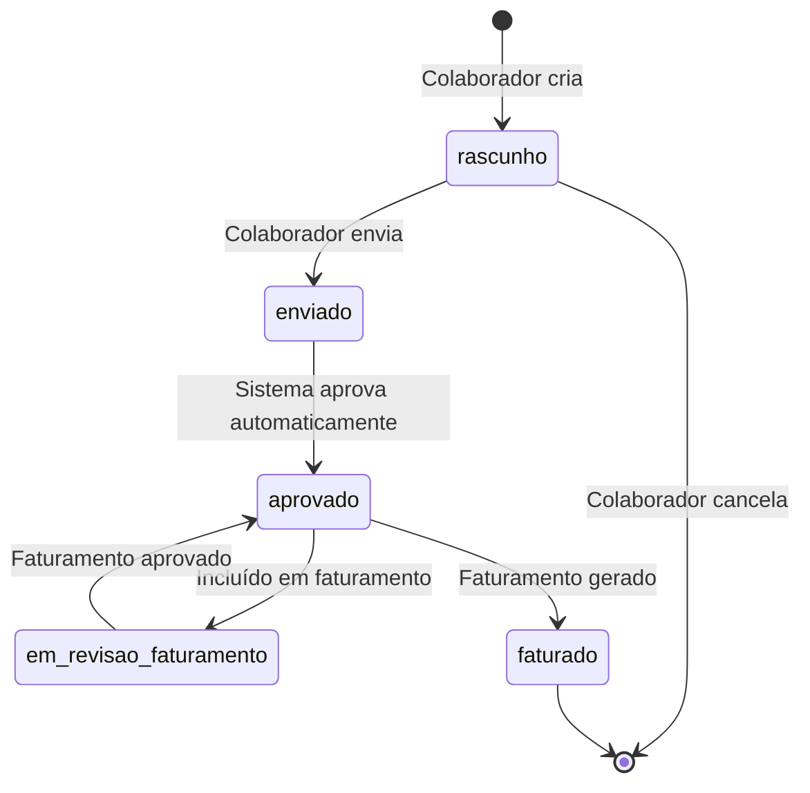
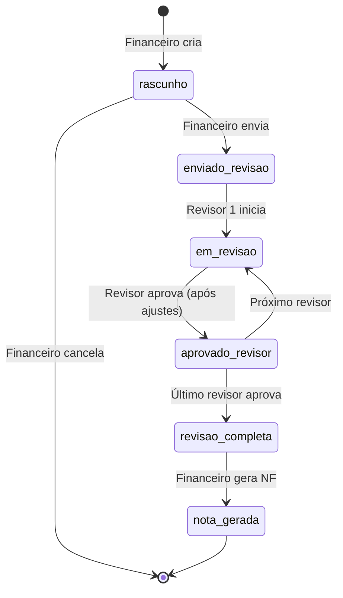
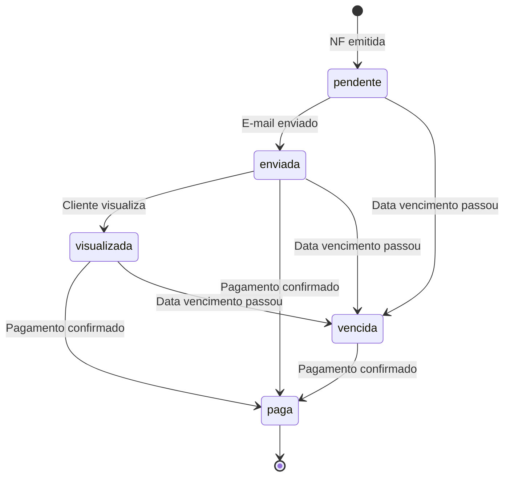

# Regras de Negócio - ERP-VLMA

## Índice
1. [Fluxo de Contratos e Casos](#1-fluxo-de-contratos-e-casos)
2. [Fluxo de Timesheet](#2-fluxo-de-timesheet)
3. [Fluxo de Faturamento](#3-fluxo-de-faturamento)
4. [Fluxo de Cobrança](#4-fluxo-de-cobrança)
5. [Fluxo de Pagamentos](#5-fluxo-de-pagamentos)
6. [Fluxo de Avaliação PDI](#6-fluxo-de-avaliação-pdi)
7. [Fluxo de Permissões e Controle de Acesso](#7-fluxo-de-permissões-e-controle-de-acesso)
   - [Regras de Acesso por Categoria de Colaborador](#70-regras-de-acesso-por-categoria-de-colaborador)
8. [Fluxo de Despesas](#8-fluxo-de-despesas)
9. [Regras de Cálculo](#9-regras-de-cálculo)
10. [Validações Gerais](#10-validações-gerais)

---

## 1. Fluxo de Contratos e Casos

### 1.1. Criação de Contrato

**Pré-condições:**
- Cliente deve existir e estar ativo
- Usuário deve ter permissão para criar contratos
- **Apenas Sócio e Administrativo podem criar contratos**
- **Advogado e Estagiário não podem criar contratos**

**Processo:**
1. Selecionar cliente
2. Preencher dados obrigatórios:
   - Nome do contrato
   - Regime de pagamento [MEI, SIMPLES NACIONAL e ETC]
   - Status (ativo/finalizado)
3. Opcionalmente anexar proposta (GED)
4. Salvar contrato

**Validações:**
- Nome do contrato é obrigatório
- Cliente deve existir
- Regime de pagamento deve ser válido
- Status deve ser "ativo" ou "finalizado"

**Pós-condições:**
- Contrato criado com status "ativo" por padrão
- Log de auditoria registrado

**Regras de Acesso por Categoria:**
- **Sócio/Administrativo**: Pode criar, editar e deletar contratos
- **Advogado**: Pode visualizar todos os contratos, mas **não pode editar dados do contrato**. Pode apenas adicionar anexos
- **Estagiário**: Pode visualizar contratos (para lançar timesheet), mas não pode criar/editar

### 1.2. Criação de Casos/Escopos

**Pré-condições:**
- Contrato deve existir e estar ativo
- Usuário deve ter permissão para criar casos
- **Apenas Sócio e Administrativo podem criar casos**
- **Advogado e Estagiário não podem criar casos**

**Processo:**
1. Selecionar contrato
2. Criar caso com:
   - Nome do caso/escopo
   - Produto relacionado (opcional)
   - Responsável pelo caso
   - Centros de custo (múltiplos)
3. Configurar regras financeiras do caso
4. Salvar caso

**Validações:**
- Nome do caso é obrigatório
- Contrato deve estar ativo
- Responsável deve ser colaborador ativo
- Pelo menos um centro de custo deve ser selecionado
- Centros de custo válidos: Societário, Tributário, Contratos, Trabalhista, Agro, Contencioso Cível

**Regras de Negócio:**
- Um contrato pode ter múltiplos casos
- Cada caso funciona como um mini-contrato independente
- Cada caso deve ter regras financeiras configuradas

**Pós-condições:**
- Caso criado e vinculado ao contrato
- Regras financeiras devem ser configuradas após criação do caso

**Regras de Acesso por Categoria:**
- **Sócio/Administrativo**: Pode criar, editar e deletar casos
- **Advogado**: Pode visualizar todos os casos, mas não pode criar/editar
- **Estagiário**: Pode visualizar casos (para lançar timesheet), mas não pode criar/editar

### 1.3. Configuração de Regras Financeiras

**Pré-condições:**
- Caso deve existir
- Caso não deve ter regras financeiras já configuradas (1:1)

**Processo:**
1. Selecionar caso
2. Configurar regras:
   - Moeda (Real ou Câmbio)
   - Tipo de nota (Nota Fiscal ou Invoice)
   - Data de início do faturamento
   - Data prevista de pagamento
   - Data de início da proposta
   - Data do reajuste monetário
   - Índice de reajuste (percentual)
3. Selecionar tipos de cobrança (múltiplos):
   - Hora
   - Hora com limite (cap)
   - Mensal
   - Mensalidade de processo
   - Projeto
   - Projeto Parcelado
   - Êxito
4. Salvar regras financeiras

**Validações:**
- Moeda é obrigatória
- Tipo de nota é obrigatório
- Data de início do faturamento é obrigatória
- Pelo menos um tipo de cobrança deve ser selecionado
- Índice de reajuste deve estar entre 0 e 100 (se informado)

**Regras de Negócio:**
- Múltiplos tipos de cobrança podem ser selecionados
- Índice de reajuste é usado para calcular automaticamente o reajuste da hora
- Data de reajuste monetário serve como alerta no dashboard

**Pós-condições:**
- Regras financeiras configuradas e vinculadas ao caso
- Caso pronto para receber timesheets e faturamentos

### 1.4. Configuração de Timesheet

**Pré-condições:**
- Contrato deve existir
- Contrato não deve ter configuração de timesheet já criada (1:1)

**Processo:**
1. Selecionar contrato
2. Configurar:
   - Enviar timesheet ao cliente? (sim/não)
3. Adicionar revisores de faturamento (múltiplos):
   - Selecionar colaborador (deve ser sócio, administrativo ou advogado)
   - Definir ordem (1 = primário, 2 = secundário, etc.)
4. Salvar configuração

**Validações:**
- Todos os revisores devem ser sócios, administrativos ou advogados
- Ordem dos revisores deve ser única e sequencial (1, 2, 3...)
- Pelo menos um revisor deve ser configurado

**Regras de Negócio:**
- **Revisores são para revisão de FATURAMENTO, não de timesheet**
- Timesheets são aprovados automaticamente após envio
- Revisão de timesheets ocorre apenas durante a revisão do faturamento
- Revisores são processados sequencialmente conforme ordem
- Revisores podem ser adicionados/removidos, mas ordem deve ser mantida
- Sócio e Administrativo podem revisar qualquer faturamento
- Advogado só pode revisar faturamentos onde está configurado como revisor

**Pós-condições:**
- Configuração de timesheet salva
- Revisores de faturamento configurados e prontos para revisar faturamentos

### 1.5. Configuração de Despesas Reembolsáveis

**Pré-condições:**
- Contrato deve existir
- Contrato não deve ter configuração de despesas já criada (1:1)

**Processo:**
1. Selecionar contrato
2. Configurar:
   - Despesas reembolsáveis (lista, primeira opção = "não")
   - Limite de adiantamento (valor)
3. Configurar rateio de pagadores (opcional):
   - Adicionar clientes pagadores
   - Definir proporção (percentual) ou valor fixo
4. Salvar configuração

**Validações:**
- Se usar proporção, valores devem somar 100%
- Limite de adiantamento deve ser positivo (se informado)
- Clientes pagadores devem estar vinculados ao contrato

**Regras de Negócio:**
- Primeira opção padrão é "não" (sem despesas reembolsáveis)
- Pode usar proporção (percentual) ou valor fixo para rateio
- Se usar proporção, todos os valores devem somar exatamente 100%

**Pós-condições:**
- Configuração de despesas salva
- Rateio de pagadores configurado (se aplicável)

---

## 2. Fluxo de Timesheet

### 2.1. Diagrama de Estados



**Nota:** A revisão de timesheet ocorre durante a revisão do faturamento, não há revisão separada antes.

#### 2.1.1. Correspondência com o modelo persistido no ERP (fonte canônica)

O sistema em produção persiste o campo `status` do timesheet com os valores **`em_lancamento`**, **`revisao`** e **`aprovado`** (API/RPC/UI). O diagrama acima permanece como **visão de domínio**; o alinhamento formal doc ↔ código está em `references/adr/ADR-005-estados-timesheet-doc-vs-persistido.md` e em `references/SPEC.md` (RF-029).

| Conceito / estado (documentação §2) | Valor `status` no ERP |
|-------------------------------------|------------------------|
| Rascunho (lançamento em edição) | `em_lancamento` |
| Enviado (transição antes da aprovação) | Sem valor dedicado na UI; fluxo conduz a `aprovado` ou `revisao` conforme RPC |
| Aprovado | `aprovado` |
| Em revisão de faturamento | `revisao` (afinamento operacional; detalhes na RPC) |
| Faturado | Campo/regra de **faturamento** (`faturado`), não um quarto valor de enum na lista de Timesheet |

### 2.2. Lançamento de Horas

**Pré-condições:**
- Colaborador deve estar ativo
- Caso deve existir e estar vinculado a contrato ativo
- Colaborador deve ter permissão para lançar timesheet
- **Estagiário**: Pode lançar para qualquer caso (visualiza todos os contratos)
- **Advogado**: Pode lançar para qualquer caso somente para ele
- **Sócio/Administrativo**: Pode lançar para qualquer caso e qualquer pessoa

**Processo:**
1. Colaborador seleciona caso
2. Preenche dados:
   - Data do apontamento
   - Quantidade de horas trabalhadas
   - Descrição do trabalho realizado
3. Sistema calcula automaticamente:
   - Valor da hora (conforme regras financeiras do caso)
   - Valor total (horas × valor_hora)
4. Salva como rascunho

**Validações:**
- Data não pode ser futura
- Horas devem ser maior que 0
- Horas não podem exceder 24 horas por dia
- Caso deve estar ativo
- Descrição é obrigatória

**Cálculos:**
```
valor_hora = valor_hora_base × (1 + indice_reajuste/100) [se aplicável]
valor_total = horas × valor_hora
```

**Regras de Negócio:**
- Valor da hora pode variar conforme regras financeiras do caso
- Reajuste monetário é aplicado automaticamente se data_reajuste <= data_apontamento
- Colaborador pode ter múltiplos apontamentos no mesmo dia para casos diferentes
- Timesheet pode ser editado enquanto estiver em "rascunho" ou "aprovado" (antes de ser incluído em faturamento)
- Timesheet pode ser editado se estiver incluído em faturamento com status "rascunho" ou "enviado_revisao"
- Timesheet **NÃO pode ser editado** se faturamento estiver em "em_revisao" (já foi enviado para revisão)

**Pós-condições:**
- Timesheet criado com status "rascunho"
- Campo `faturado` = false

### 2.3. Envio e Aprovação Automática

**Pré-condições:**
- Timesheet deve estar em status "rascunho"
- Timesheet deve ter dados válidos

**Processo:**
1. Colaborador revisa o timesheet
2. Clica em "Enviar"
3. Sistema valida dados
4. Status muda para "enviado"
5. Sistema aprova automaticamente (status = "aprovado")

**Validações:**
- Todos os campos obrigatórios devem estar preenchidos
- Horas devem ser válidas
- Caso deve estar ativo

**Regras de Negócio:**
- Após enviar, aprovação é automática
- Timesheet aprovado fica disponível para inclusão em faturamento
- **Timesheet pode ser editado mesmo após aprovado**, desde que:
  - Não esteja incluído em faturamento, OU
  - Esteja incluído em faturamento com status "rascunho" ou "enviado_revisao"
- **Timesheet NÃO pode ser editado** se faturamento estiver em "em_revisao" (já foi enviado para revisão pelos revisores)
- Revisão ocorre apenas durante a revisão do faturamento

**Pós-condições:**
- Status = "aprovado"
- Timesheet disponível para inclusão em faturamento
- Campo `faturado` = false

### 2.4. Edição de Timesheet

**Pré-condições:**
- Timesheet deve existir
- Timesheet não deve estar em faturamento com status "em_revisao" ou superior
- Usuário deve ter permissão para editar

**Processo:**
1. Colaborador ou administrador acessa timesheet
2. Pode editar:
   - Horas trabalhadas
   - Caso
   - Descrição
   - Data do apontamento
3. Sistema recalcula valor_total automaticamente
4. Se timesheet estiver em faturamento, atualiza valor do item de faturamento

**Validações:**
- Timesheet não pode ser editado se faturamento estiver em "em_revisao", "revisao_completa", "aprovado" ou "nota_gerada"
- Timesheet pode ser editado se:
  - Estiver em "rascunho" ou "aprovado" (não incluído em faturamento), OU
  - Estiver incluído em faturamento com status "rascunho" ou "enviado_revisao"
- Colaborador só pode editar seus próprios timesheets (exceto sócio/administrativo)

**Regras de Negócio:**
- Timesheet pode ser editado até o faturamento ser enviado para revisão (status "em_revisao")
- Quando faturamento está em "em_revisao", timesheet não pode mais ser editado pelo colaborador (apenas revisores podem editar)
- Sócio e Administrativo podem editar qualquer timesheet (até faturamento entrar em revisão)
- Advogado pode editar apenas seus próprios timesheets
- Estagiário pode editar apenas seus próprios timesheets
- Se timesheet estiver em faturamento, edição atualiza automaticamente o valor do item

**Cálculos:**
```
valor_total = horas × valor_hora
// Se em faturamento, atualiza valor_original do item
```

**Pós-condições:**
- Timesheet atualizado
- Se em faturamento: item de faturamento atualizado com novo valor_original

### 2.5. Edição Durante Revisão de Faturamento

**Pré-condições:**
- Timesheet deve estar em status "aprovado"
- Timesheet deve estar incluído em faturamento com status "em_revisao"
- Revisor de faturamento deve ter permissão

**Processo:**
1. Revisor de faturamento visualiza timesheet no contexto do faturamento
2. Revisor pode editar:
   - Horas trabalhadas
   - Descrição
   - Valor da hora (se permitido)
3. Sistema recalcula valor_total
4. Sistema atualiza valor_revisado do item de faturamento

**Validações:**
- Revisor deve ser sócio, administrativo OU advogado configurado como revisor
- Faturamento deve estar em revisão ("em_revisao")
- Alterações devem ser justificadas (observações)
- Colaborador original não pode mais editar (faturamento já está em revisão)

**Regras de Negócio:**
- **Esta é a única revisão de timesheet** - não há revisão separada antes do faturamento
- **Apenas revisores podem editar** quando faturamento está em "em_revisao"
- Colaborador original não pode mais editar timesheet quando faturamento está em revisão
- Alterações em timesheet durante revisão de faturamento atualizam automaticamente o item de faturamento
- Valor revisado sobrescreve valor original no cálculo do faturamento
- Histórico de alterações deve ser mantido
- Sócio e Administrativo podem revisar qualquer faturamento (não precisam estar configurados)
- Advogado pode revisar apenas faturamentos onde está configurado como revisor

**Cálculos:**
```
valor_total_revisado = horas_revisadas × valor_hora_revisado
valor_final_item = valor_total_revisado
```

**Pós-condições:**
- Timesheet atualizado
- Item de faturamento atualizado com valor_revisado
- Status do timesheet = "em_revisao_faturamento"

### 2.6. Marcação como Faturado

**Pré-condições:**
- Timesheet deve estar aprovado
- Faturamento deve ser gerado (status = "nota_gerada")

**Processo:**
1. Sistema verifica faturamentos vinculados ao timesheet
2. Se faturamento gerou nota fiscal, marca timesheet como faturado
3. Campo `faturado` = true

**Validações:**
- Timesheet não pode ser faturado duas vezes
- Faturamento deve ter nota fiscal gerada

**Regras de Negócio:**
- Timesheet marcado como faturado não pode ser incluído em novos faturamentos
- Marcação é automática quando nota fiscal é gerada

**Pós-condições:**
- Campo `faturado` = true
- Timesheet não aparece mais na lista de itens disponíveis para faturamento

---

## 3. Fluxo de Faturamento

### 3.1. Diagrama de Estados



**Nota:** Revisores não rejeitam faturamentos. Se encontrarem algo errado, ajustam os itens e aprovam.

### 3.2. Visualização de Itens em Aberto

**Pré-condições:**
- Contrato deve existir
- Usuário deve ter permissão de financeiro OU ser revisor do contrato
- **Sócio/Administrativo**: Acesso a todos os itens
- **Advogado**: Acesso apenas a itens de faturamentos onde é revisor + seus timesheets
- **Estagiário**: Sem acesso a itens a faturar

**Processo:**
1. Financeiro seleciona contrato
2. Sistema consolida itens em aberto via API:
   - **Timesheets não faturados**: Busca timesheets aprovados com `faturado = false` dos casos do contrato
   - **Pagamentos únicos não faturados**: API busca das regras financeiras com tipo "Projeto" ou "Êxito" não faturados
   - **Pagamentos recorrentes não faturados**: API busca das regras financeiras com tipo "Mensal" ou "Mensalidade de processo" não faturados no período
3. Sistema exibe lista consolidada por caso

**Validações:**
- Contrato deve estar ativo
- Deve haver pelo menos um item em aberto

**Regras de Negócio:**
- API consolida informações em tempo de execução (não há tabela)
- Itens são agrupados por caso para facilitar visualização
- Financeiro (sócio/administrativo) pode ver detalhes de cada item antes de selecionar
- **Advogado**: Vê apenas itens de faturamentos onde está configurado como revisor + seus próprios timesheets
- **Estagiário**: Não tem acesso a visualização de itens a faturar
- Itens selecionados podem ser ajustados pelos revisores durante a revisão

**Exemplo de Consolidação:**
```
Contrato: Contrato ABC
├── Caso 1: Planejamento Tributário
│   ├── Timesheets: 3 itens (total: 40h, R$ 8.000,00)
│   └── Pagamentos recorrentes: 1 item (Mensal: R$ 5.000,00)
└── Caso 2: Ajuizamento de ação
    ├── Timesheets: 2 itens (total: 20h, R$ 4.000,00)
    └── Pagamentos únicos: 1 item (Projeto: R$ 10.000,00)
```

### 3.3. Criação de Faturamento

**Pré-condições:**
- Contrato deve existir e estar ativo
- Deve haver itens em aberto
- Usuário deve ter permissão de financeiro

**Processo:**
1. Financeiro seleciona contrato
2. Visualiza itens em aberto (consolidados via API)
3. Seleciona itens para incluir no faturamento:
   - Pode selecionar de múltiplos casos
   - Pode selecionar timesheets, pagamentos únicos e recorrentes
4. Define período de faturamento (início e fim)
5. Sistema cria faturamento com status "rascunho"
6. Sistema cria itens de faturamento para cada item selecionado

**Validações:**
- Pelo menos um item deve ser selecionado
- Período de faturamento deve ser válido (início <= fim)
- Itens selecionados não podem estar já faturados
- Todos os itens devem pertencer ao mesmo contrato

**Regras de Negócio:**
- Faturamento pode incluir itens de múltiplos casos do mesmo contrato
- Cada item selecionado vira um registro em `itens_faturamento`
- Valor bruto inicial = soma dos valores originais dos itens
- Revisores são copiados da configuração do contrato

**Cálculos Iniciais:**
```
valor_bruto = Σ(valor_original_item) para todos os itens selecionados
```

**Pós-condições:**
- Faturamento criado com status "rascunho"
- Itens de faturamento criados
- Revisores de faturamento criados (copiados do contrato)
- Casos vinculados ao faturamento

### 3.4. Envio para Revisão

**Pré-condições:**
- Faturamento deve estar em status "rascunho"
- Faturamento deve ter pelo menos um item
- Deve haver pelo menos um revisor configurado

**Processo:**
1. Financeiro revisa faturamento
2. Clica em "Enviar para Revisão"
3. Sistema valida dados
4. Status muda para "enviado_revisao"
5. Primeiro revisor é notificado

**Validações:**
- Todos os campos obrigatórios devem estar preenchidos
- Deve haver pelo menos um item de faturamento
- Deve haver pelo menos um revisor configurado
- Período de faturamento deve ser válido

**Regras de Negócio:**
- Após enviar, financeiro não pode mais editar
- Primeiro revisor recebe notificação automática
- Todos os revisores têm status "pendente" inicialmente
- Revisores ajustam itens se necessário e aprovam (não há rejeição)

**Pós-condições:**
- Status = "enviado_revisao"
- Primeiro revisor recebe notificação
- Revisores criados com status "pendente"

### 3.5. Revisão Sequencial por Múltiplos Revisores

**Pré-condições:**
- Faturamento deve estar em status "enviado_revisao" ou "em_revisao"
- Revisor deve estar configurado no faturamento
- Revisor anterior deve ter aprovado (exceto primeiro revisor)
- **Revisor deve ser sócio OU advogado configurado como revisor**
- **Estagiário não pode revisar faturamentos**

**Processo:**
1. Revisor visualiza faturamento:
   - Vê contrato e casos incluídos
   - Vê todos os itens (timesheets, pagamentos únicos, pagamentos recorrentes, despesas)
   - Pode revisar por caso
2. Revisor pode:
   - **Alterar itens de faturamento**: Edita valores, descrições, horas (em timesheets)
   - **Ajustar valores**: Corrige valores de qualquer item se encontrar algo errado
   - **Aprovar**: Passa para próximo revisor ou completa revisão
3. Sistema atualiza valores e status conforme ações

**Validações:**
- Revisor deve ser sócio, administrativo OU advogado configurado como revisor
- Revisor deve estar na lista de revisores do faturamento (exceto sócio/administrativo que podem revisar qualquer faturamento)
- Revisor só pode revisar quando for sua vez (ordem)
- Alterações em timesheets devem ser justificadas
- Estagiário não pode revisar faturamentos

**Regras de Negócio:**
- **Revisão de timesheets ocorre durante a revisão do faturamento** (não há revisão separada)
- **Revisores podem ajustar qualquer item de faturamento** se encontrarem algo errado
- **Não há opção de rejeitar** - revisor ajusta os itens e aprova
- Revisão ocorre sequencialmente conforme ordem configurada
- Cada revisor deve aprovar antes do próximo revisar
- Revisores podem alterar:
  - **Timesheets**: Horas, descrição, valor da hora
  - **Pagamentos únicos**: Valor, descrição
  - **Pagamentos recorrentes**: Valor, descrição
  - **Despesas reembolsáveis**: Valor, descrição
- Alterações atualizam automaticamente `valor_revisado` do item
- Último revisor aprova → status muda para "revisao_completa"
- Sócio e Administrativo podem revisar qualquer faturamento (não precisam estar configurados)
- Advogado só pode revisar faturamentos onde está configurado como revisor

**Estados dos Revisores:**
- `pendente`: Aguardando sua vez
- `em_revisao`: Revisando atualmente
- `aprovado`: Aprovado, aguardando próximo

**Cálculos Durante Revisão:**
```
Para cada item alterado:
  valor_revisado = novo_valor_calculado
  valor_final = valor_revisado (se existir) ou valor_original

valor_bruto_atualizado = Σ(valor_final_item) para todos os itens
```

**Pós-condições:**
- Se aprovado por todos: status = "revisao_completa"
- Valores atualizados conforme alterações
- Histórico de alterações mantido

### 3.6. Cálculo de Valores (Bruto e Líquido)

**Pré-condições:**
- Faturamento deve estar em status "revisao_completa"
- Todos os revisores devem ter aprovado

**Processo:**
1. Sistema calcula valor bruto final:
   - Soma todos os valores finais dos itens
2. Sistema calcula valor líquido:
   - Aplica regime de pagamento (impostos)
   - Calcula descontos (se houver)
3. Sistema atualiza faturamento

**Cálculos:**
```
valor_bruto = Σ(valor_final_item) para todos os itens

// Regime de pagamento define impostos aplicados
impostos = calcular_impostos(valor_bruto, regime_pagamento)

valor_liquido = valor_bruto - impostos
```

**Regras de Negócio:**
- Valor bruto = soma dos valores finais dos itens (após revisão)
- Valor líquido = valor bruto - impostos (conforme regime)
- Regime de pagamento define quais impostos são aplicados
- Cálculo ocorre automaticamente quando revisão é completa

**Exemplo:**
```
Valor bruto: R$ 27.000,00
Regime: Simples Nacional (6%)
Impostos: R$ 1.620,00
Valor líquido: R$ 25.380,00
```

**Pós-condições:**
- Valor bruto calculado
- Valor líquido calculado
- Faturamento pronto para gerar nota fiscal

### 3.7. Geração de Nota Fiscal

**Pré-condições:**
- Faturamento deve estar em status "revisao_completa"
- Valor líquido deve estar calculado
- Cliente deve ter dados fiscais válidos

**Processo:**
1. Financeiro visualiza faturamento aprovado
2. Clica em "Gerar Nota Fiscal"
3. Sistema valida dados do cliente
4. Sistema cria nota fiscal:
   - Tipo conforme regras financeiras (NF ou Invoice)
   - Número sequencial
   - Valores do faturamento
   - Dados do cliente
5. Status do faturamento muda para "nota_gerada"
6. Status da nota fiscal = "emitida"

**Validações:**
- Cliente deve ter CNPJ válido (se não for estrangeiro)
- Dados fiscais do cliente devem estar completos
- Tipo de nota deve estar definido nas regras financeiras
- Número da nota fiscal deve ser único

**Regras de Negócio:**
- Nota fiscal é gerada automaticamente a partir do faturamento
- Valores da NF = valores do faturamento (bruto e líquido)
- Número da NF é sequencial por tipo
- Após gerar NF, faturamento não pode ser alterado
- Timesheets incluídos são marcados como faturados

**Pós-condições:**
- Nota fiscal criada e vinculada ao faturamento
- Status do faturamento = "nota_gerada"
- Status da nota fiscal = "emitida"
- Timesheets marcados como faturados
- Pronto para criar cobrança

---

## 4. Fluxo de Cobrança

### 4.1. Diagrama de Estados



### 4.2. Criação de Cobrança

**Pré-condições:**
- Nota fiscal deve estar emitida
- Cliente deve ter e-mail cadastrado

**Processo:**
1. Sistema cria cobrança automaticamente após emissão de NF
2. Sistema gera boleto de pagamento:
   - Código de barras
   - Linha digitável
   - URL para visualização
3. Sistema seleciona template de e-mail (padrão ou configurado)
4. Cobrança criada com status "pendente"

**Validações:**
- Nota fiscal deve existir e estar emitida
- Cliente deve ter e-mail cadastrado
- Valor da cobrança = valor da nota fiscal

**Regras de Negócio:**
- Cobrança centraliza: boleto, nota fiscal e e-mail
- Boleto é gerado automaticamente
- Template de e-mail padrão é usado se não especificado
- Data de vencimento = data_vencimento da nota fiscal

**Pós-condições:**
- Cobrança criada com status "pendente"
- Boleto gerado
- Pronto para envio de e-mail

### 4.3. Envio de E-mail

**Pré-condições:**
- Cobrança deve estar criada
- Template de e-mail deve existir
- Cliente deve ter e-mail válido

**Processo:**
1. Financeiro ou sistema automático envia e-mail
2. Sistema substitui variáveis do template:
   - {nome_cliente}
   - {valor}
   - {data_vencimento}
   - {linha_digitavel}
   - {url_boleto}
3. E-mail é enviado ao cliente
4. Status muda para "enviada"
5. Data de envio é registrada

**Validações:**
- E-mail do cliente deve ser válido
- Template deve existir
- Todas as variáveis devem ser substituídas

**Regras de Negócio:**
- E-mail pode ser enviado manualmente ou automaticamente
- Template suporta variáveis dinâmicas
- Histórico de envio é mantido
- Múltiplos envios são permitidos

**Pós-condições:**
- Status = "enviada"
- E-mail enviado
- Data de envio registrada

### 4.4. Atualização Automática de Status

**Pré-condições:**
- Cobrança deve existir
- Pagamento relacionado deve ser confirmado

**Processo:**
1. Sistema monitora pagamentos vinculados à cobrança
2. Quando pagamento é confirmado:
   - Status da cobrança muda automaticamente para "paga"
   - Data de pagamento é atualizada
3. Sistema atualiza status da nota fiscal para "paga"

**Validações:**
- Pagamento deve estar vinculado à cobrança
- Status do pagamento deve ser "confirmado"

**Regras de Negócio:**
- Atualização é automática e imediata
- Status "paga" é definitivo (não pode voltar)
- Nota fiscal também é atualizada para "paga"
- Múltiplos pagamentos podem quitar uma cobrança (parcelas)

**Cálculo de Quitação:**
```
valor_pago = Σ(valor_pagamento) para pagamentos confirmados
cobranca_quitada = valor_pago >= valor_cobranca
```

**Pós-condições:**
- Status = "paga"
- Nota fiscal atualizada para "paga"
- Processo de cobrança finalizado

### 4.5. Cálculo de Vencimento

**Pré-condições:**
- Cobrança deve ter data de vencimento
- Status não deve ser "paga"

**Processo:**
1. Sistema verifica data de vencimento diariamente
2. Se data_vencimento < hoje e status != "paga":
   - Status muda automaticamente para "vencida"
3. Sistema notifica financeiro sobre cobranças vencidas

**Validações:**
- Data de vencimento deve existir
- Status atual não deve ser "paga"

**Regras de Negócio:**
- Verificação ocorre diariamente (job agendado)
- Status "vencida" pode mudar para "paga" se pagamento for confirmado
- Notificações são enviadas para financeiro

**Pós-condições:**
- Status = "vencida" (se aplicável)
- Notificação enviada

---

## 5. Fluxo de Pagamentos

### 5.1. Recebimento de Pagamentos

**Pré-condições:**
- Cliente deve existir
- Nota fiscal ou cobrança deve existir
- Usuário deve ter permissão para registrar pagamentos

**Processo:**
1. Financeiro registra pagamento recebido
2. Preenche dados:
   - Cliente
   - Valor
   - Data de pagamento
   - Forma de pagamento
   - Vincula à cobrança (opcional)
3. Sistema valida dados
4. Pagamento criado com status "pendente"

**Validações:**
- Cliente deve existir
- Valor deve ser maior que 0
- Data de pagamento não pode ser futura
- Forma de pagamento deve ser válida
- Se vinculado à cobrança, valor não pode exceder valor da cobrança

**Regras de Negócio:**
- Pagamento pode ser parcial (parcelas)
- Múltiplos pagamentos podem quitar uma cobrança
- Pagamento pode ser registrado antes da confirmação bancária

**Pós-condições:**
- Pagamento criado com status "pendente"
- Aguardando confirmação

### 5.2. Confirmação de Pagamento

**Pré-condições:**
- Pagamento deve existir
- Pagamento deve estar em status "pendente"
- Confirmação bancária deve ser verificada

**Processo:**
1. Financeiro verifica confirmação bancária
2. Confirma pagamento no sistema
3. Status muda para "confirmado"
4. Sistema atualiza automaticamente:
   - Status da cobrança para "paga" (se vinculado)
   - Status da nota fiscal para "paga" (se vinculado)

**Validações:**
- Pagamento deve existir
- Status deve ser "pendente"
- Confirmação bancária deve ser verificada

**Regras de Negócio:**
- Confirmação atualiza status automaticamente
- Cobrança vinculada é atualizada automaticamente
- Nota fiscal vinculada é atualizada automaticamente
- Múltiplos pagamentos podem quitar uma cobrança

**Cálculo de Quitação:**
```
Para cobrança vinculada:
  valor_total_pago = Σ(valor) para pagamentos confirmados
  cobranca_quitada = valor_total_pago >= valor_cobranca
  
  Se cobranca_quitada:
    status_cobranca = "paga"
    status_nota_fiscal = "paga"
```

**Pós-condições:**
- Status do pagamento = "confirmado"
- Status da cobrança = "paga" (se aplicável)
- Status da nota fiscal = "paga" (se aplicável)

### 5.3. Realização de Pagamentos

**Pré-condições:**
- Despesa ou prestador deve existir
- Usuário deve ter permissão para realizar pagamentos

**Processo:**
1. Financeiro registra pagamento a realizar
2. Preenche dados:
   - Destinatário (prestador, colaborador, parceiro)
   - Valor
   - Data de vencimento
   - Forma de pagamento
   - Vincula à despesa (se aplicável)
3. Sistema valida dados
4. Pagamento criado com status "pendente"

**Validações:**
- Destinatário deve existir
- Valor deve ser maior que 0
- Data de vencimento deve ser válida
- Se vinculado à despesa, valor deve corresponder

**Regras de Negócio:**
- Pagamentos realizados são para despesas, colaboradores, prestadores ou parceiros
- Podem ser vinculados a despesas reembolsáveis ou não

**Pós-condições:**
- Pagamento criado com status "pendente"
- Aguardando confirmação de realização

---

## 6. Fluxo de Avaliação PDI

### 6.1. Calendário PDI

**Datas Importantes:**
- **Avaliação Prévia**: Junho
- **Avaliação Definitiva**: Janeiro
- **Aplicação do Reajuste**: Fevereiro

### 6.2. Criação de Avaliação

**Pré-condições:**
- Colaborador deve existir e estar ativo
- Ano de avaliação deve ser válido
- Tipo deve ser "prévia" ou "definitiva"

**Processo:**
1. RH cria avaliação PDI
2. Seleciona colaborador
3. Define ano e tipo de avaliação
4. Sistema cria avaliação com status inicial

**Validações:**
- Colaborador deve existir
- Ano deve ser atual ou anterior
- Tipo deve ser "prévia" ou "definitiva"
- Não pode haver duas avaliações do mesmo tipo no mesmo ano

**Regras de Negócio:**
- Avaliação prévia em junho, definitiva em janeiro
- Cada colaborador pode ter uma prévia e uma definitiva por ano
- Avaliação definitiva substitui a prévia do mesmo ano

**Pós-condições:**
- Avaliação criada
- Pronta para preenchimento

### 6.3. Preenchimento de DNA VLMA, Skills e Metas

**Pré-condições:**
- Avaliação deve existir
- Usuário deve ter permissão para avaliar

**Processo:**
1. Avaliador preenche DNA VLMA:
   - Nome
   - Descrição
   - Nota (0 a 10)
2. Avaliador preenche Skills da Carreira:
   - 5 campos se cargo normal
   - 8 campos se adicional = "Liderança" ou "Estratégico"
   - Nome, descrição, nota (0 a 10) para cada
3. Avaliador preenche Metas Individuais:
   - Até 5 campos
   - Nome, descrição, nota (0 a 10) para cada
4. Sistema calcula nota final automaticamente

**Validações:**
- DNA VLMA é obrigatório (1 campo)
- Skills: 5 campos (normal) ou 8 campos (liderança/estratégico)
- Metas: máximo 5 campos
- Todas as notas devem estar entre 0 e 10
- Descrição é obrigatória para cada item

**Regras de Negócio:**
- Skills da Carreira: quantidade depende do adicional do colaborador
- Se adicional = "Liderança" ou "Estratégico": 8 campos
- Se adicional = null: 5 campos
- Metas Individuais: sempre máximo 5 campos

**Pós-condições:**
- DNA VLMA preenchido
- Skills preenchidos
- Metas preenchidas
- Nota final calculada

### 6.4. Cálculo de Nota Final

**Fórmula:**
```
nota_final = média_simples de todos os itens

itens = [DNA_VLMA] + [Skills_Carreira] + [Metas_Individuais]

nota_final = Σ(nota_item) / quantidade_itens
```

**Exemplo:**
```
DNA VLMA: 8.5
Skills (5 campos): 7.0, 8.0, 7.5, 8.5, 9.0
Metas (3 campos): 8.0, 7.5, 8.5

Total de itens: 1 + 5 + 3 = 9
Soma das notas: 8.5 + 7.0 + 8.0 + 7.5 + 8.5 + 9.0 + 8.0 + 7.5 + 8.5 = 71.5
Nota final: 71.5 / 9 = 7.94
```

**Validações:**
- Todas as notas devem estar preenchidas
- Nota final deve estar entre 0 e 10

**Regras de Negócio:**
- Média simples de todos os itens
- Arredondamento para 2 casas decimais
- Nota final determina resultado

**Pós-condições:**
- Nota final calculada e armazenada

### 6.5. Determinação de Resultado

**Pré-condições:**
- Nota final deve estar calculada
- Avaliação deve estar completa

**Processo:**
1. Sistema determina resultado baseado na nota final:
   - **Mantém faixa atual**: Nota < 7.0
   - **Progressão simples**: 7.0 ≤ Nota < 8.5
   - **Progressão diferenciada**: Nota ≥ 8.5
2. Sistema atualiza campo `resultado`

**Validações:**
- Nota final deve estar calculada
- Resultado deve ser determinado automaticamente

**Regras de Negócio:**
- Resultado é determinado automaticamente pela nota final
- Faixas podem ser ajustadas conforme política da empresa
- Resultado determina tipo de progressão salarial

**Tabela de Resultados:**
| Nota Final | Resultado |
|------------|-----------|
| < 7.0 | Mantém faixa atual |
| 7.0 - 8.49 | Progressão simples |
| ≥ 8.5 | Progressão diferenciada |

**Pós-condições:**
- Resultado determinado
- Pronto para aplicação de reajuste

### 6.6. Aplicação de Reajuste Salarial

**Pré-condições:**
- Avaliação definitiva deve estar completa
- Mês deve ser fevereiro
- Resultado deve estar determinado

**Processo:**
1. Sistema identifica avaliações definitivas do ano anterior
2. Para cada avaliação:
   - Verifica resultado
   - Aplica progressão conforme resultado:
     - **Mantém faixa atual**: Sem alteração
     - **Progressão simples**: Aumento padrão (ex: 1 nível)
     - **Progressão diferenciada**: Aumento maior (ex: 2 níveis)
3. Sistema atualiza salário do colaborador
4. Sistema atualiza cargo (se aplicável)

**Validações:**
- Avaliação deve ser definitiva
- Ano da avaliação deve ser anterior ao atual
- Reajuste não deve ter sido aplicado ainda

**Regras de Negócio:**
- Reajuste é aplicado em fevereiro
- Aplicação é automática baseada no resultado
- Progressão pode alterar cargo (ex: Junior 3 → Junior 4)
- Salário é atualizado conforme nova faixa

**Exemplo de Progressão:**
```
Colaborador: João Silva
Cargo atual: Junior 3
Salário atual: R$ 8.000,00
Nota final: 8.7
Resultado: Progressão diferenciada

Aplicação:
- Novo cargo: Junior 5 (pula 1 nível)
- Novo salário: R$ 10.000,00 (conforme faixa do cargo)
```

**Pós-condições:**
- Salário atualizado
- Cargo atualizado (se aplicável)
- Reajuste aplicado e registrado

---

## 7. Fluxo de Permissões e Controle de Acesso

### 7.0. Regras de Acesso por Categoria de Colaborador

**Categorias:**
- `sócio`: Sócio da empresa
- `advogado`: Advogado da empresa
- `administrativo`: Funcionário administrativo
- `estagiário`: Estagiário

#### 7.0.1. Sócio

**Acesso:**
- **Acesso geral** a todos os dados do sistema
- Pode visualizar, criar, editar e deletar qualquer registro
- Pode configurar revisores
- Pode revisar faturamentos (timesheets são revisados durante revisão de faturamento)
- Pode gerar relatórios e análises
- Pode lançar timesheets para qualquer colaborador

**Restrições:**
- Nenhuma restrição de acesso

**Regras de Negócio:**
- Sócios têm acesso completo ao sistema
- Podem ser configurados como revisores de faturamento
- Podem revisar qualquer faturamento (não precisa estar configurado)
- Podem gerenciar permissões de outros colaboradores
- Podem lançar timesheets em nome de qualquer colaborador

#### 7.0.2. Administrativo

**Acesso:**
- **Acesso geral** a todos os dados do sistema
- Pode visualizar, criar, editar e deletar qualquer registro
- Pode configurar revisores
- Pode revisar faturamentos (timesheets são revisados durante revisão de faturamento)
- Pode gerar relatórios e análises
- Pode lançar timesheets para qualquer colaborador

**Restrições:**
- Nenhuma restrição de acesso

**Regras de Negócio:**
- Administrativos têm acesso completo ao sistema (mesmas capacidades que sócio)
- Podem ser configurados como revisores de faturamento
- Podem revisar qualquer faturamento (não precisa estar configurado)
- Podem gerenciar permissões de outros colaboradores
- Podem lançar timesheets em nome de qualquer colaborador

#### 7.0.3. Advogado

**Acesso:**
- **Visualização:**
  - Pode ver todos os contratos e casos
  - Pode ver suas próprias timesheets
  - Pode ver timesheets dos casos vinculados (onde é revisor)
- **Itens a Faturar:**
  - Apenas itens de faturamentos onde está configurado como revisor
  - Apenas seus próprios timesheets
- **Revisão:**
  - Pode revisar faturamentos **apenas se estiver configurado como revisor** no contrato
  - Pode revisar/editar timesheets durante revisão de faturamento (se for revisor)
- **Edição:**
  - **NÃO pode editar dados do contrato** (campos, configurações, etc.)
  - **Pode adicionar anexos** aos contratos
  - Pode editar seus próprios timesheets (em rascunho)
  - Pode editar timesheets durante revisão de faturamento (se for revisor)
- **Lançamento:**
  - Pode lançar timesheets apenas para si mesmo

**Restrições:**
- Não pode criar/editar contratos
- Não pode criar/editar casos
- Não pode configurar revisores
- Não pode gerar notas fiscais
- Não pode revisar sem estar configurado como revisor
- Não pode lançar timesheets para outros colaboradores

**Regras de Negócio:**
- Advogado precisa estar explicitamente configurado como revisor para revisar
- Acesso a itens de faturamento é limitado aos faturamentos onde é revisor
- Pode visualizar todos os contratos e casos, mas não pode editá-los
- Pode adicionar anexos/documentos aos contratos

**Exemplo de Acesso:**
```
Advogado: João Silva
- Configurado como revisor no Contrato ABC
- Responsável pelo Caso 1 do Contrato ABC

Acesso:
✓ Ver todos os contratos e casos
✓ Ver suas próprias timesheets
✓ Ver timesheets do Caso 1
✓ Revisar faturamentos do Contrato ABC (é revisor)
✓ Revisar/editar timesheets durante revisão de faturamento do Contrato ABC
✓ Ver itens a faturar do Contrato ABC
✓ Lançar timesheets para si mesmo
✗ Revisar faturamentos de outros contratos (não é revisor)
✗ Editar dados do Contrato ABC
✓ Adicionar anexos ao Contrato ABC
✗ Lançar timesheets para outros colaboradores
```

#### 7.0.4. Estagiário

**Acesso:**
- **Visualização:**
  - Pode ver todos os contratos (para lançar timesheet)
  - Pode ver seus próprios timesheets
  - Pode ver casos onde é responsável
  - Acesso limitado aos dados vinculados
- **Criação:**
  - Pode criar timesheets para qualquer caso (visualiza todos os contratos)
  - Pode editar seus próprios timesheets (em rascunho)

**Restrições:**
- Não pode ver faturamentos
- Não pode ver itens a faturar
- Não pode revisar timesheets ou faturamentos
- Não pode criar/editar contratos
- Não pode criar/editar casos
- Não pode ver dados financeiros detalhados
- Não pode gerar relatórios

**Regras de Negócio:**
- Estagiário tem acesso limitado ao necessário para suas funções
- Pode lançar timesheets em qualquer caso (precisa ver contratos)
- Acesso é restrito principalmente aos seus próprios dados
- Não tem acesso a informações financeiras sensíveis

**Exemplo de Acesso:**
```
Estagiário: Maria Santos
- Responsável pelo Caso 2 do Contrato XYZ

Acesso:
✓ Ver todos os contratos (para selecionar ao lançar timesheet)
✓ Ver Caso 2 (é responsável)
✓ Criar timesheet para qualquer caso (apenas para si mesmo)
✓ Ver seus próprios timesheets
✓ Editar seus timesheets em rascunho
✗ Ver faturamentos
✗ Ver itens a faturar
✗ Revisar faturamentos
✗ Editar contratos/casos
✗ Lançar timesheets para outros colaboradores
```

### 7.1. Herança de Permissões do Cargo

**Pré-condições:**
- Cargo deve existir
- Cargo deve ter features configuradas
- Colaborador deve estar vinculado a um cargo

**Processo:**
1. Sistema verifica cargo do colaborador
2. Sistema busca features do cargo
3. Sistema aplica permissões base do cargo ao colaborador

**Validações:**
- Cargo deve existir
- Colaborador deve ter cargo definido

**Regras de Negócio:**
- Permissões são herdadas automaticamente do cargo
- Features do cargo definem permissões base
- Colaborador herda todas as features permitidas do cargo

**Pós-condições:**
- Permissões base aplicadas
- Colaborador pode ter permissões customizadas

### 7.2. Customização por Colaborador

**Pré-condições:**
- Colaborador deve existir
- Usuário deve ter permissão para gerenciar permissões

**Processo:**
1. Administrador acessa permissões do colaborador
2. Define se herda cargo:
   - Se `herdar_cargo = true`: Usa permissões do cargo + customizações
   - Se `herdar_cargo = false`: Usa apenas customizações
3. Define permissões customizadas (JSONB)
4. Sistema salva customizações

**Validações:**
- Colaborador deve existir
- Permissões customizadas devem ser válidas (JSON válido)

**Regras de Negócio:**
- Customizações sobrescrevem permissões do cargo quando há conflito
- Se herdar_cargo = true: permissões = cargo + customizações (customizações têm prioridade)
- Se herdar_cargo = false: permissões = apenas customizações
- Permissões são verificadas em tempo de execução

**Exemplo:**
```
Cargo: Junior 3
Features do cargo: [criar_timesheet, visualizar_contratos, editar_casos]

Colaborador: João
herdar_cargo: true
permissoes_customizadas: {
  "editar_casos": false,  // Remove permissão
  "gerar_relatorios": true  // Adiciona permissão
}

Permissões finais: [criar_timesheet, visualizar_contratos, gerar_relatorios]
```

**Pós-condições:**
- Permissões customizadas salvas
- Permissões efetivas atualizadas

### 7.3. Verificação de Permissões

#### 7.3.0. Fonte de verdade no ERP-VLMA (RBAC)

| Camada | O que o sistema usa |
|--------|---------------------|
| Edge Functions (repo) | JWT + RPC `get_user_permissions` → conjunto de `permission_key`; checagem por chave (com curingas documentados no frontend em `permission-keys.ts`) |
| Categoria (`§7.0`) | **Perfil típico** para política e configuração de cargos; **não** um ramo alternativo `if (categoria)` duplicado em cada função HTTP analisada |
| Vínculos (revisor, responsável, etc.) | Podem ser aplicados **dentro das RPCs** de negócio (ex.: faturamento), além do RBAC |

Decisão formal: **`references/adr/ADR-007-categorias-colaborador-vs-rbac-permission-key.md`** (O-4).

**Pré-condições:**
- Colaborador deve estar autenticado
- Ação deve ser identificada

**Processo:**
1. Sistema identifica ação solicitada
2. Sistema resolve **permissões efetivas** do colaborador (cargo + customizações, §7.1–7.2), materializadas em `permission_key` via `get_user_permissions`
3. Sistema verifica se a ação é permitida por **RBAC** (e por regras de vínculo na RPC, quando existirem)
4. Se permitido: executa ação
5. Se não permitido: retorna erro de permissão

**Nota sobre §7.0:** Os fluxos narrativos “por categoria” abaixo (**Fluxo de Verificação por Categoria**) permanecem como **modelo conceitual** útil para QA e configuração de roles (o que um advogado *tipicamente* recebe). A implementação HTTP versionada neste repositório não replica esse pseudocódigo como segunda árvore de decisão paralela às `permission_key`.

**Validações:**
- Colaborador deve estar autenticado
- Ação deve ser válida
- `permission_key` efetivas devem cobrir a operação (ou a RPC nega)
- Vinculação deve ser verificada na RPC quando a regra de negócio exigir

**Regras de Negócio:**
- Verificação ocorre em cada requisição (servidor)
- **Permissões efetivas** (lista de chaves) são o critério de autorização nas Edge Functions; a **categoria** orienta a **política** de quais chaves um papel costuma receber, sem substituir o RBAC em tempo de execução
- Advogado / estagiário podem depender de **vínculos** para certas operações, conforme implementado nas RPCs (além das chaves)
- Permissões podem ser cacheadas no cliente para UX; o servidor permanece autoritativo
- Log de tentativas de acesso negado é mantido (quando habilitado)

**Fluxo de Verificação por Categoria:**

**Sócio/Administrativo:**
```
1. Verifica autenticação → OK
2. Verifica categoria → Sócio/Administrativo
3. Acesso permitido (sem verificação adicional)
4. Pode revisar qualquer faturamento (não precisa estar configurado)
5. Pode lançar timesheets para qualquer colaborador
```

**Advogado:**
```
1. Verifica autenticação → OK
2. Verifica categoria → Advogado
3. Verifica ação:
   - Visualizar contratos/casos → Permitido
   - Ver timesheets próprios → Permitido
   - Ver itens a faturar → Verifica se é revisor
   - Revisar faturamento → Verifica se é revisor configurado
   - Revisar/editar timesheet no faturamento → Verifica se é revisor do faturamento
   - Editar contrato → Negado (apenas anexos)
   - Adicionar anexo → Permitido
   - Lançar timesheet → Apenas para si mesmo
```

**Estagiário:**
```
1. Verifica autenticação → OK
2. Verifica categoria → Estagiário
3. Verifica ação:
   - Ver contratos (para lançar timesheet) → Permitido
   - Criar timesheet → Permitido (apenas para si mesmo)
   - Ver próprios timesheets → Permitido
   - Ver faturamentos → Negado
   - Revisar faturamentos → Negado
   - Lançar timesheet para outros → Negado
```

**Pós-condições:**
- Ação executada (se permitido)
- Erro retornado (se não permitido)
- Log registrado

---

## 8. Fluxo de Despesas

### 8.1. Criação de Despesas Reembolsáveis

**Pré-condições:**
- Caso deve existir
- Prestador de serviço deve existir (se aplicável)
- Usuário deve ter permissão para criar despesas

**Processo:**
1. Usuário cria despesa reembolsável
2. Seleciona caso (obrigatório para reembolsáveis)
3. Preenche dados:
   - Descrição
   - Valor
   - Data da despesa
   - Prestador de serviço (opcional)
   - Data de vencimento (se aplicável)
4. Sistema valida dados
5. Despesa criada com status "pendente"

**Validações:**
- Caso é obrigatório para despesas reembolsáveis
- Valor deve ser maior que 0
- Data da despesa não pode ser futura
- Caso deve estar ativo

**Regras de Negócio:**
- Despesas reembolsáveis devem estar vinculadas a um caso
- Despesas reembolsáveis podem ser incluídas em faturamentos
- Despesas reembolsáveis são repassadas ao cliente

**Pós-condições:**
- Despesa criada com status "pendente"
- Vinculada ao caso
- Pronta para inclusão em faturamento

### 8.1.1. Modelo ERP-VLMA (implementação vigente vs §8.1–8.4)

O texto das seções **8.1 a 8.4** descreve um fluxo conceitual completo (incluindo tipo **reembolsável / não reembolsável** e ciclo **pendente → pago**). O **ERP-VLMA** na rota de Despesas (`/despesas`, Edge Functions `get-despesas` / `create-despesa` / `update-despesa`) opera com **outro conjunto normativo**, para evitar ambiguidade:

| Aspecto | Documentação conceitual (§8) | ERP-VLMA (lista / formulário atuais) |
|--------|------------------------------|--------------------------------------|
| Caso | Obrigatório só para reembolsável; proibido para não reembolsável (§8.2) | **Caso sempre obrigatório** (fluxo cliente → contrato → caso) |
| Tipo `reembolsavel` / `nao_reembolsavel` | Explícito em modelo de dados amplo | **Não há** seletor de tipo na UI; trata-se de **despesa de caso** no fluxo operacional |
| Status | `pendente`, `pago`, etc. | **`em_lancamento`**, **`revisao`**, **`aprovado`**, **`cancelado`** |
| Inclusão em faturamento (§8.3) | Reembolsável e `pendente` | Em linha com “itens a faturar”: tipicamente **`em_lancamento`** e `caso_id` presente (detalhe na RPC de faturamento) |
| Pagamento §8.4 (`pago`) | Atualização de status após pagamento | **Não** mapeado 1:1 para o enum da lista; pode existir em outro módulo ou evolução futura |

**Decisão de produto registrada em** `references/adr/ADR-006-despesas-reembolso-doc-vs-implementado.md`: a variante **§8.2 (despesa interna sem caso)** **não está implementada** na tela atual; **RF-030** e `references/CONTRACTS.md` fecham o contrato para integradores.

### 8.2. Criação de Despesas Não Reembolsáveis

**Pré-condições:**
- Prestador de serviço deve existir (se aplicável)
- Usuário deve ter permissão para criar despesas

**Processo:**
1. Usuário cria despesa não reembolsável
2. Preenche dados:
   - Descrição
   - Valor
   - Data da despesa
   - Prestador de serviço (opcional)
   - Data de vencimento (se aplicável)
3. Sistema valida dados
4. Despesa criada com status "pendente"

**Validações:**
- Valor deve ser maior que 0
- Data da despesa não pode ser futura
- Caso não deve ser informado (não reembolsável)

**Regras de Negócio:**
- Despesas não reembolsáveis são despesas internas
- Não são repassadas ao cliente
- Não são incluídas em faturamentos

**Pós-condições:**
- Despesa criada com status "pendente"
- Pronta para pagamento

### 8.3. Inclusão em Faturamento

**Pré-condições:**
- Despesa deve ser reembolsável
- Despesa deve estar em status "pendente"
- Faturamento deve estar em status "rascunho"

**Processo:**
1. Financeiro seleciona despesas reembolsáveis ao criar faturamento
2. Sistema cria item de faturamento para cada despesa
3. Despesa vinculada ao faturamento

**Validações:**
- Despesa deve ser reembolsável
- Despesa não deve estar já incluída em outro faturamento
- Faturamento deve estar em rascunho

**Regras de Negócio:**
- Apenas despesas reembolsáveis podem ser incluídas
- Despesa não pode estar em múltiplos faturamentos
- Valor da despesa é incluído no valor bruto do faturamento

**Pós-condições:**
- Despesa incluída no faturamento
- Item de faturamento criado

### 8.4. Pagamento de Despesas

**Pré-condições:**
- Despesa deve existir
- Despesa deve estar em status "pendente"
- Usuário deve ter permissão para pagar despesas

**Processo:**
1. Financeiro registra pagamento da despesa
2. Cria pagamento vinculado à despesa
3. Status da despesa muda para "pago"

**Validações:**
- Despesa deve existir
- Valor do pagamento deve corresponder ao valor da despesa
- Pagamento deve ser confirmado

**Regras de Negócio:**
- Despesas não reembolsáveis são pagas diretamente
- Despesas reembolsáveis podem ser pagas antes ou depois do faturamento
- Status "pago" é definitivo

**Pós-condições:**
- Status da despesa = "pago"
- Pagamento registrado

---

## 9. Regras de Cálculo

### 9.1. Cálculo de Valor de Timesheet

**Fórmula:**
```
valor_hora = valor_hora_base × (1 + indice_reajuste/100) [se aplicável]

valor_total = horas × valor_hora
```

**Condições:**
- Se `data_reajuste_monetario` <= `data_apontamento`: aplica reajuste
- Se não: usa valor_hora_base

**Exemplo:**
```
Valor hora base: R$ 200,00
Índice de reajuste: 5%
Data reajuste: 01/01/2024
Data apontamento: 15/01/2024

Valor hora = R$ 200,00 × (1 + 5/100) = R$ 210,00
Horas: 8h
Valor total = 8 × R$ 210,00 = R$ 1.680,00
```

### 9.2. Cálculo de Valor Líquido (Regime de Pagamento)

**Fórmula:**
```
impostos = calcular_impostos(valor_bruto, regime_pagamento)

valor_liquido = valor_bruto - impostos
```

**Regimes de Pagamento:**
- **Simples Nacional**: 6% sobre valor bruto
- **Lucro Presumido**: 15% sobre valor bruto
- **Lucro Real**: Varia conforme faturamento
- **MEI**: 6% sobre valor bruto

**Exemplo:**
```
Valor bruto: R$ 10.000,00
Regime: Simples Nacional (6%)

Impostos = R$ 10.000,00 × 0.06 = R$ 600,00
Valor líquido = R$ 10.000,00 - R$ 600,00 = R$ 9.400,00
```

### 9.3. Cálculo de Reajuste Monetário

**Fórmula:**
```
percentual_reajuste = ((indice_novo - indice_anterior) / indice_anterior) × 100

valor_reajustado = valor_anterior × (1 + percentual_reajuste/100)
```

**Exemplo:**
```
Índice anterior: 5.0%
Índice novo: 5.5%

Percentual reajuste = ((5.5 - 5.0) / 5.0) × 100 = 10%

Valor hora anterior: R$ 200,00
Valor hora reajustado = R$ 200,00 × (1 + 10/100) = R$ 220,00
```

### 9.4. Cálculo de Nota Final PDI

**Fórmula:**
```
nota_final = Σ(nota_item) / quantidade_itens

itens = [DNA_VLMA] + [Skills_Carreira] + [Metas_Individuais]
```

**Exemplo:**
```
DNA VLMA: 8.5
Skills (5): 7.0, 8.0, 7.5, 8.5, 9.0
Metas (3): 8.0, 7.5, 8.5

Total itens: 9
Soma: 71.5
Nota final: 71.5 / 9 = 7.94
```

### 9.5. Cálculo de Progressão Salarial

**Regras:**
- **Mantém faixa atual**: Sem alteração
- **Progressão simples**: +1 nível de cargo
- **Progressão diferenciada**: +2 níveis de cargo

**Exemplo:**
```
Cargo atual: Junior 3
Salário atual: R$ 8.000,00
Resultado: Progressão diferenciada

Novo cargo: Junior 5 (pula 1 nível)
Novo salário: R$ 10.000,00 (conforme faixa do cargo)
```

---

## 10. Validações Gerais

### 10.1. Validações de Campos Obrigatórios

**Regra Geral:**
- Campos marcados como `NOT NULL` são obrigatórios
- Campos opcionais podem ser nulos

**Validações Específicas:**
- **CNPJ**: Obrigatório se cliente não for estrangeiro
- **CPF**: Obrigatório para colaboradores
- **OAB**: Obrigatório apenas para categoria "advogado"
- **Email**: Obrigatório e único para colaboradores (usado para login)

### 10.2. Validações de Unicidade

**Campos Únicos:**
- CNPJ de clientes
- CPF de colaboradores
- Email de colaboradores
- OAB de colaboradores
- Número de nota fiscal
- Nome de produtos, segmentos, grupos, categorias

**Regras:**
- Tentativa de criar registro duplicado retorna erro
- Validação ocorre antes de salvar

### 10.3. Validações de Integridade Referencial

**Regras:**
- Foreign Keys devem referenciar registros existentes
- Não é possível deletar registro referenciado
- Cascata de exclusão deve ser configurada conforme regra de negócio

**Exemplos:**
- Não deletar cliente com contratos ativos
- Não deletar colaborador com timesheets
- Não deletar caso com faturamentos

### 10.4. Validações de Regras de Negócio Específicas

**Validações por Entidade:**

**CLIENTES:**
- CNPJ válido (se não for estrangeiro)
- Cliente estrangeiro não precisa de CNPJ

**COLABORADORES:**
- CPF válido e único
- Email único (usado para login)
- OAB obrigatório apenas para advogados
- Percentual adicional entre 5% e 20% (se adicional não for null)

**CONTRATOS:**
- Status deve ser "ativo" ou "finalizado"
- Contrato ativo pode ter casos

**CASOS:**
- Pelo menos um centro de custo
- Deve ter regras financeiras configuradas

**TIMESHEETS:**
- Horas entre 0 e 24 por dia
- Data não pode ser futura
- Caso deve estar ativo

**FATURAMENTOS:**
- Pelo menos um item deve ser selecionado
- Período válido (início <= fim)
- Todos os revisores devem aprovar antes de gerar NF

**AVALIAÇÕES PDI:**
- Skills: 5 campos (normal) ou 8 campos (liderança/estratégico)
- Metas: máximo 5 campos
- Notas entre 0 e 10

---

## Observações Finais

### Auditoria
- Todas as ações importantes são registradas em logs de auditoria
- Logs incluem: usuário, ação, dados anteriores, dados novos, timestamp

### Performance
- Índices são criados em campos frequentemente consultados
- Queries são otimizadas para grandes volumes de dados
- Cache é usado para permissões e configurações

### Segurança
- Senhas são armazenadas como hash
- Permissões são verificadas em cada requisição
- Dados sensíveis são criptografados

### Exceções
- Todas as exceções são tratadas e logadas
- Mensagens de erro são claras e objetivas
- Rollback é feito em caso de erro em transações
